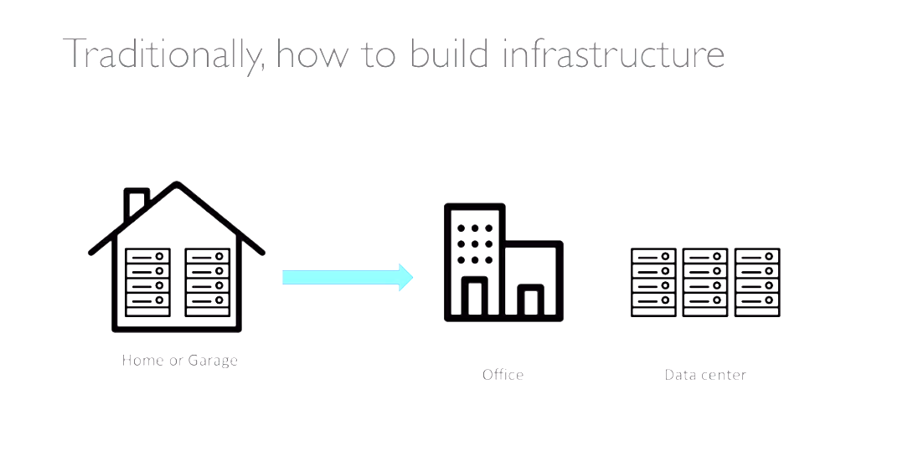

What is cloud computing?
========================

Traditional IT approach
-----------------------

Problems
--------

- Pay for the rent for the data center.
- Pay for power supply, cooling and maintenance.
- Adding and replacing software takes time.
- Scaling is limited.
- Hire 24/7 team to monitor the infrastructure.
- How to deal with disasters?

Fortunately, nowadays we can externalize this problems with cloud computing.

Cloud Computing
---------------

Cloud computing is the **on-demand delivery** of compute power, database storage, and other IT resources. You can access to a cloud services platform with **pay-as-you-go pricing**. An advantage of this platform is that you can provision exactly the right type and size of computing resources you need. As well, you can access as them as you need, almost instantly in a simple way.

Amazon Web Services owns and maintains the network-connected hardware required for these application services, while you provision and use what you need via a web application. Below we share some cloud services that probably you have been used:

The next image summarize the different deployments models of the cloud:

It is important to highlight the five characteristics of cloud computing:

1. **On-demand self service**: Users can provision resources and use them without human interaction from the service provider.
2. **Broad network access**: Resources available over the network, and can be accessed by diverse client platforms.
3. **Multi-tenancy and resource pooling**: Multiple customers can share the same infrastructure and applications with security and privacy, serviced from the same physical resources.
4. **Rapid elasticy and scalability**: Automatically and quickly acquire and dispose resources when needed. Moreover, is quick and easy scale based on demand.
5. **Measured service**: Usage is measured, users can pay correctly for what they have used.

In combo with this characteristics, we have the six advantage of cloud computing:

1. Trade capital expense (CAPEX) for operational expense (OPEX).
2. Benefit from massive economies of scale.
3. Stop guessing capacity.
4. Increase speed and agility.
5. Stop spending money running and maintaining data centers.
6. Go global in minutes; leverage the AWS global infrastructure.

To sum up, here are the problems solved by the cloud:

- **Flexibility**: change resource types when needed.
- **Cost-Effectiveness**: pay as you go, for what you use.
- **Scalability**: accommodate larger loads by making hardware stronger or adding some nodes.
- **Elasticity**: ability to scale out and scale in when needed.
- **High-Availability**: build across data centers
- **Agility**: rapidly develop, test and launch software applications.

Types of Cloud Computing
------------------------

Infrastructure as a Service (IaaS) provide building blocks for cloud IT like networking, computers, data storage space and leverage a high level of flexibility. In short is a parallel with traditional on-premises IT. (e.g., Amazon EC2, GCP, Azure and Digital Ocean).

Platform as a Services (PaaS) removes the need for your organization to manage the underlying infrastructure, focus on the deploymen and management of your applications (e.g., Elastic Beanstalk and Heroku)

The last one is Software as a Service (SaaS), that is a complete product that is run and manages by the service provider (Google Apps, Dropbox and Zoom).

Below is an image to show the management of responsibilities according the type of cloud computing:

.

Keep in mind that the pricing of the cloud with AWS is based on 3 fundamentals under the pay-as-you-go model:

- Compute
- Storage
- Data transfer out of the cloud

This solve the expensive issue of traditional IT.
