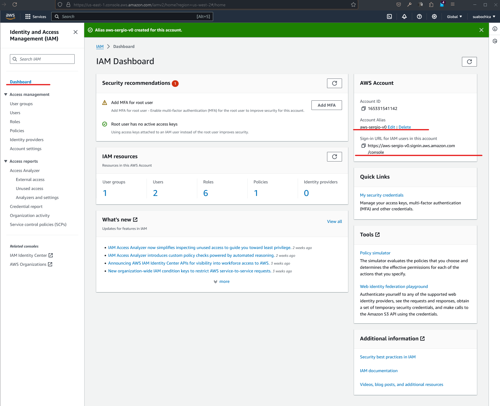
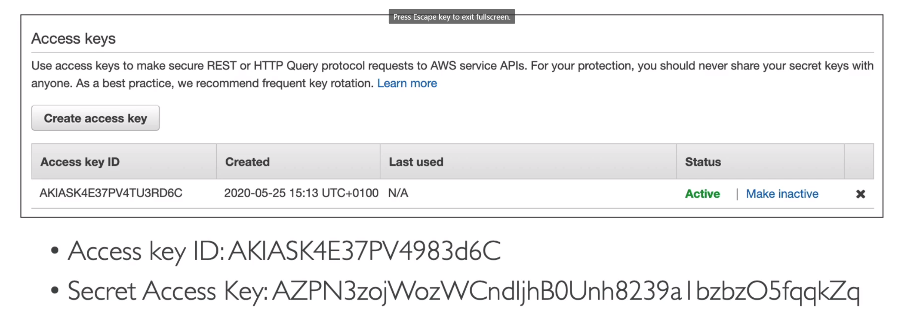

(IAM) Identity and Access Management
====================================

The identity and access manage is a global service in AWS to define user and groups. A root account is created by default and should not be user or shared. The users are people withing your organization, and can be grouped. Groups only contain users, not other groups. Users do not have to belong to a group, and user can belong to multiple groups. The next images is an example of definition for user and groups in your enterprise under AWS:


The users or groups are assigned in JSON documents called policies. Below we have an example of a policy.

```json
{
    "Version": "2012-10-17",
    "Statement": [
        {
            "Effect": "Allow",
            "Action": "ec2:Describe",
            "Resource": "*",
        },
        {
            "Effect": "Allow",
            "Action": "elasticloadbalancing:Describe",
            "Resource": "*",
        },
        {
            "Effect": "Allow",
            "Action": [
                "cloudwatch:ListMetrics",
                "cloudwatch:GetMetricsStatistics",
                "cloudwatch:Describe",
            ],
            "Resource": "*",
        },
    ]
}
```

These policies define the permissions of the user on the AWS ecosystem. In AWS is recommended apply the **least privilege principle**: do not give more permissions that a user needs.

So it is time to hands on to create a user and assigned it to a group. Keep in mind the it is not a good practice work with the root user of AWS. So let's create and user called "sergio" with the option _I want to create an IAM user_ and assigned it a password. Next add permission to this user via a group that it will called "admin-group" and it will use the policy name _Administrator Access_. Once the user "sergio" is associated to the group "admin-group" you can add some tags. Tags are used in AWS resources to help to identify, organize or search these resources. In short it is metadata in key-value pairs. For this case we can add the key "Department" with the value "Engineering" to identify that the user "sergio" is part of the Engineering Department.

Once created the user and associated to the board lets create an alias to the AWS account. Navigate to the **Dashboard** section and edit the Account Alias in the AWS Account card, to use a legible alias like "aws-sergio-v0" instead of an account id like "165331541142" as shown the next image":



Then copy the URL in the "Sign-in URL for IAM user in this account", open the browser in private mode, paste this URL an access to IAM with the user and the password created previously. Now, you should see in your windows with the browser, the access as a root account and the access as an IAM user.

IAM Policies
------------

Check the next image:


Here Alice, Bob, and Charles are a group of developers and we attached a policy to this specific group. That is mean that every single member of the group will all get access an inherit the policy of the developers group. Now, David and Edward are related to the group operations that have a different policy. Then we have Fred that is a user that not to belong to a group. We can create an inline policy which is associated to users that meet the condition of not be part of a group. Finally Charles and David both belong to the audit team. That means that Charles inherit two policies; one from the developers team and another to the audit team. In the same way, David has a policy for the operation team and another for the audit team

Below, it is shared and example of the structure of a JSON file with the policies:

```json
{
    "Version": "2012-10-17",                                // policy language version, always has a date format
    "Id": "S3-Account-Permissions",                         // (optional) an identifier for the policy
    "Statement": [                                          // one or more individual statements
        {
            "Sid": "1",                                     // (optional) an identifier for the statement
            "Effect": "Allow",                              // whether the statement allows or denies access
            "Principal": {
                "AWS": ["arn:aws:iam::123456789012:root"]   // account/user/role to which this policy applied to
            }, 
            "Action": [
                "s3:GetObject",                             // list of actions to this policy
                "s3:PutObject"
            ],
            "Resource": "[arn:aws:s3:::mybucket/*"],        // list of resources to which the action applied to
        }
    ]
}
```

To go deep with the policies yoy can click in the **Policies** section in the sidebar a select a policy from the list. In the image below you see the JSON created for the _AdministratorAccess_ policy.


It is important to know that you can create your own policy via a visual editor or creating you own JSON policy file. The invitation is open to get detailed information about the list of policies that AWS offer to us.

IAM Security on Users
---------------------

AWS offers two mechanism to handle authentication and authorization for the users; **passwords** and **multi-factor authenticator (a.k.a MFA)**.

With passwords we should encourage strong ones for higher security for your account. AWS allows to setup a password policy with stuff like a minimum password length, requires specific character types, allow all IAM users to change their own passwords, define periods of time for password expiration and prevent password re-use. This mechanism is good for IAM Users.

In the other hand, we have MFA for users that have access to your account and can possibly change configurations or delete resources in your AWS account. The idea is protect your root accounts and IAM users. MFA is the combination of a password you know, plus security device you own. The main benefit of MFA is that if a password is stolen or hacked, the account is not compromised.

There are several MFA devices options in AWS:

- Virtual MFA device; support for multiple tokens in a single device (e.g., Google Authenticator --phone only-- and Authy --multi-device--).
- Universal 2nd Factor (U2F) Security Key; support for multiple root and IAM users using a single security key (e.g., Yubikey by Yubico)
- Hardware Key Fob Device

So that's it, we knew the theory on how to protect your account.

AWS Access Keys, CLI and SDK
----------------------------

The users can access to AWS via three options:

- AWS Management Console, protected by password and MFA
- AWS Command Line Interface (CLI), protected by access keys
- AWS Software Development Kit (SDK), for code and protected by access key.

The access keys are generated through the AWS Console. The users manage their own access keys and the are secret, just like a password so please don't shared them. A valid equivalence is associate the Access Key Id as an username and a Secret Access Key as a password. Below it is shared an example:



The [CLI](https://github.com/aws/aws-cli) is a tool tha enables you to interact with AWS service using commands in your command line shell. You have direct access to the public APIs of AWS service and you can develop scripts to manage your resources. All this commands are prefixed with `aws`. This tool is open source and it is an alternative to use the AWS Management Console.

The SDK is language-specific to APIs and it enables you to access and manage AWS services programmatically embedded within your application. It supports several programming languages, mobiles SDKs and IoT devices. An example is the AWS CL, that is built on AWS SDK for python.

A good alternative to handle AWS as CLI is AWS CloudShell. You can enable it using the icon highlighted in the next image:


Just validate that is available in your region and you can use it even as a files repository.

IAM Roles
---------

An IAM role is just like and user, but, they are intended to be used not by physical people, instead they will be used by AWS Service. This is a bit confusing so let's clarify it with an example. One of the AWS services is EC2. An EC2 instance is a virtual server and it could perform some action in AWS. So, to execute this actions we need to give permissions to out EC2 instance, creating a IAM role and together they are going to make our entity. The next image summarizes this description:


Some common roles in AWS are EC2 instance roles, lambda function roles and roles for CloudFormation.

IAM Security Tools
------------------

To control the security in IAM we have two options:

- IAM Credentials Report (account-level)
- IAM Access Advisor (account-level)

The credentials report is a list of all your accounts users and the status of their various credentials. In the next image you can check where to download this `.csv` file:


In the other hand, the access advisor shows the services permissions granted to a user and when those services were last accessed. You can use this information to revise your policies. The next image shows where you can check the access advisor for a user:


To summarize, access advisor becomes very helpful whe you need to do granular user access permissions on AWS.
