Elastic Compute Cloud (E2C)
===========================

A good idea is to set up a billing budget to know when we go over spending money on AWS and get alerted in case of we are near to overpass our budget. To achieve that please activate the **IAM user and role access to Billing information** from your account user to enable that the IAM users can access to billing information. Then, log in as IAM user with admin permission and click in the **Billing and Cost Management** option of the dropdown of you AWS account. The next image illustrate this step:

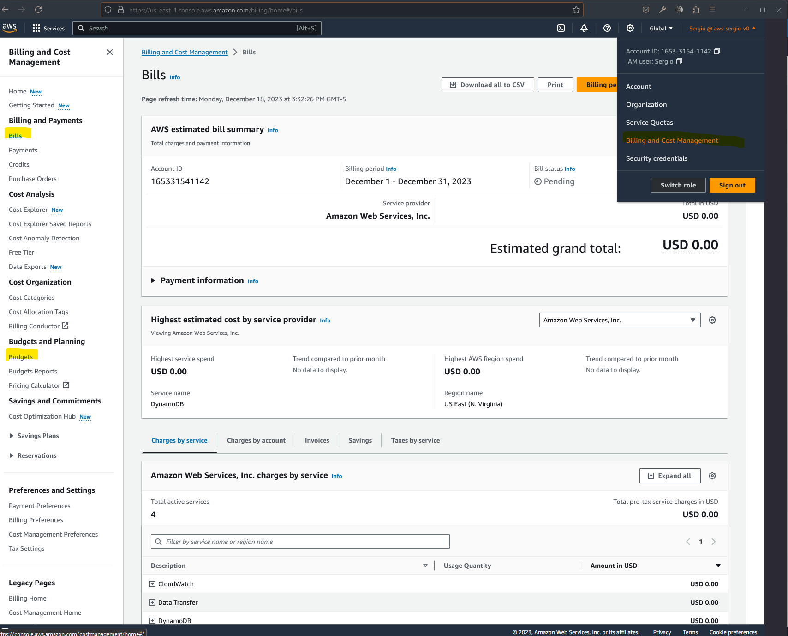

In the Bills section you will have a dashboard with the summary of the cost that you have from the use of AWS. In the other hand, you can define a budget from a template to set the criteria about the expected cost to spend using AWS monthly. For example I expect to spend 10 USD monthly for the use of E2C. When you define a budget, you should share an email, and when the budget be near to the limit, AWS will alert you that you are near to exceed the cost limit.

EC2 Basics
----------

Elastic Compute Cloud (a.k.a EC2) is a way to do Infrastructure as a Service on AWS and is one of the most popular tools offering by AWS. It is not just one service, it is compose of the next things a high level:

- Renting virtual machines (EC2).
- Storing data on virtual drives (Elastic Bucket Storage).
- Distributing load across machines (Elastic Load Balances).
- Scaling the services (Auto Scaling Group).

Knowing how to use EC2 in AWS is fundamental to understand how the cloud works. In that order, below are the specifications that we can define over the EC2 instances:

- Operating System e.g., Linux.
- CPU; Compute power and cores e.g., 4 cores.
- RAM; Random Access Memory e.g., 8 Gigabytes.
- Storage space e.g., 120 Gigabytes.
- Network card e.g., speed and public IP address.
- Firewall rules e.g., security group.
- Bootstrap script e.g., configure at first launch via EC2 user data.

Here is important highlight the bootstrap script. Bootstraping means launching commands when a machine start, and this command only run once at the instance first start. Is use to automate boot task such as; installing updates, installing software, download common files from Internet, etc. It runs with the root user and keep in mind that the more you add into your EC2 user data script the more your instance has to do at boot time.

The next image shows different types of EC2 instances:

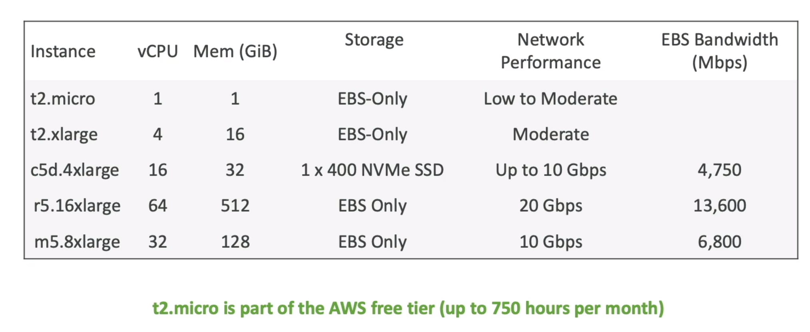

As you can see the `t2.tier` is part of the free tier, so it is a good option to start to play with EC2.

EC2 Types
---------

EC2 uses instances types that are optimized for different use cases, based in categories like: general purpose, computed optimized, memory optimized, etc. Moreover AWS use the following naming convention:

```
m5.2xlarge
```

where;

- m: instances class (biased by the use case).
- 5: generation.
- 2xlarge: size within instance class.

For instance, the **general purpose** instances are great for diversity of workloads such as web server or code repositories. Encourage a balance between compute, memory and network. The free tier `t2.micro` is a general purpose EC2 instance.

For other side the **compute optimized** are great for compute-intensive task that require high performance processors to perform activities like batch processing workloads, media transcoding, high performance computing, scientific modeling, machine learning or dedicated gaming services.

The **memory optimized** instance are used to fast performance for workloads that process large data sets in memory. Some use cases are distributed web scale cache stores, in memory databases optimized for business intelligence or application performing real-time processing of big unstructured data.

Finally the **storage optimized** are great for storage-intensive tasks that require high, sequential read and write access to large data sets on local storage. Some actions are high frequency online transaction processing systems, relation/non-relational databases, cache for in-memory databases (e.g., redis), data warehousing applications or distributed file systems.

For more information please visit the [EC2 instances types](https://aws.amzon.com/ec2/instance-types) and check the [Vantage](https://instances.vantage.sh/) to complete list of EC2 instances with different specifications.

EC2 Security Groups
-------------------

Security groups are the fundamental of network security in AWS because they control how traffic is allowed into or out the EC2 instances. The next image show how a security group wrap and EC2 instance to control the traffic with the world web wide.

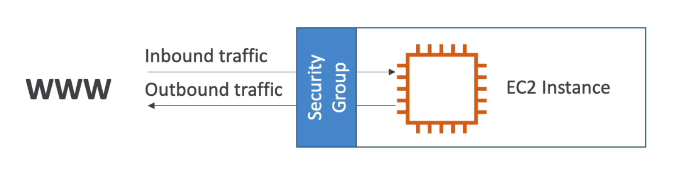

The security groups only contain _allow_ rules, and these rules can reference by IP or by another security group. Going deeper, the security groups are acting as a _firewall_ on EC2 instances and they regulate; access to ports, authorized IP ranges, control the inbound network (from other to the instance) and control of outbound network (from the instance to other). Below a diagram of how a security group manage the inbound and the outbound of a EC2 instance:

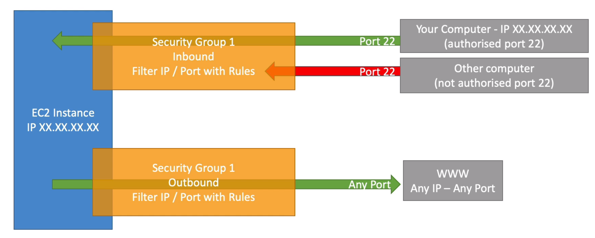

It is good to know that the security group can be attached to multiple instances. They are locked down to a region/VPC combination and they live _outside_ the EC2, so if the traffic is blocked the EC2 instance won't see it. Also, it is good to maintain one separate security group for SSH access, so if your application is not accessible (_timeout_), then it is a security group issue. Then, if your application gives a _connection refused_ error then it is an application error or it is not launched.

Lastly it is important that a security group can reference other security groups. The next diagram is an example of how several security groups can interact:

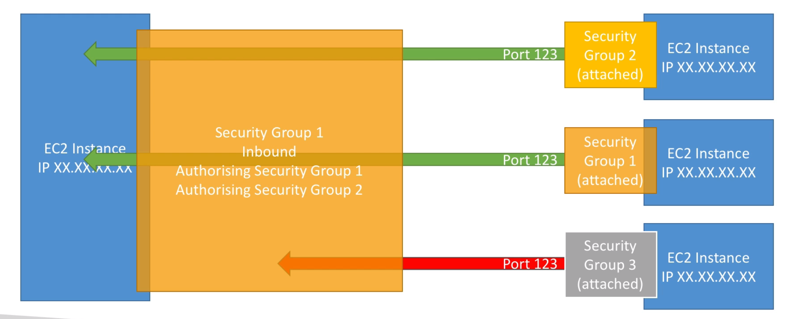

To complement the security group it is good to know the classic ports. The next table wrap up the most popular ones.

|  Number  |                             Assignment                             |
|:--------:|:------------------------------------------------------------------:|
|    20    |             File Transfer Protocol (FTP) Data Transfer             |
|    21    |            File Transfer Protocol (FTP) Command Control            |
|    22    |                  Secure Shell (SSH) Secure Login                   |
|    23    |       Telnet remote login service, unencrypted text messages       |
|    25    |        Simple Mail Transfer Protocol (SMTP) email delivery         |
|    53    |                  Domain Name System (DNS) service                  |
|  67, 68  |             Dynamic Host Configuration Protocol (DHCP)             |
|    80    |   Hypertext Transfer Protocol (HTTP) used in the World Wide Web    |
|   110    |                    Post Office Protocol (POP3)                     |
|   119    |               Network News Transfer Protocol (NNTP)                |
|   123    |                    Network Time Protocol (NTP)                     |
|   143    | Internet Message Access Protocol (IMAP) Management of digital mail |
|   161    |             Simple Network Management Protocol (SNMP)              |
|   194    |                     Internet Relay Chat (IRC)                      |
|   443    |               HTTP Secure (HTTPS) HTTP over TLS/SSL                |
| 546, 547 |                    DHCPv6 IPv6 version of DHCP                     |
|   3389   |    Remote Desktop Protocol (RDP) to log into a Windows instance    |

SSH Overview
------------

You are getting some problems with trickier bits that are running in the cloud and you are probably wondering how to connect inside your servers to perform some maintenance action. The next table summarize the technologies that enable us this connection according you OS:

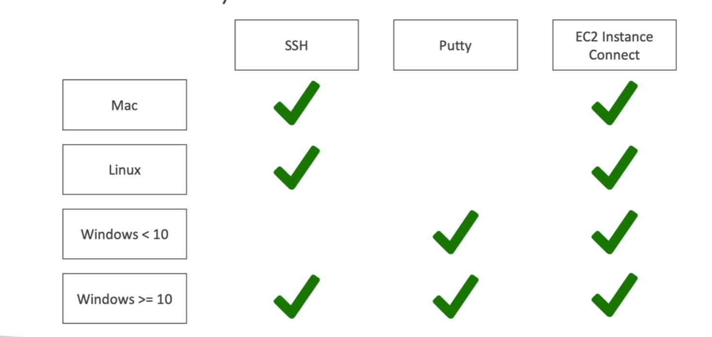

So, you can use a secure shell (SSH) into the servers. SSH is one of the most important function because it allows you to control a remote machine using a command line interface. You should set up a SSH client with the credentials in the `.pem` file that you download at the moment of create a EC2 Instance and the Public IPv4 address of your instance (e.g., 18.208.142.113).

So, open a terminal and navigate to the directory with the  `.pem` file. Then run then next command:

```sh
ssh -i EC2Tutorial.pem ec2-user@18.208.142.113
```

If you get this output:

```txt
@@@@@@@@@@@@@@@@@@@@@@@@@@@@@@@@@@@@@@@@@@@@@@@@@@@@@@@@@@@
@         WARNING: UNPROTECTED PRIVATE KEY FILE!          @
@@@@@@@@@@@@@@@@@@@@@@@@@@@@@@@@@@@@@@@@@@@@@@@@@@@@@@@@@@@
Permissions 0644 for 'EC2Tutorial.pem' are too open.
It is required that your private key files are NOT accessible by others.
This private key will be ignored.
Load key "EC2Tutorial.pem": bad permissions
ec2-user@18.208.142.113: Permission denied (publickey,gssapi-keyex,gssapi-with-mic).
```

It means that you have the wrong permissions for the `EC2Tutorial.pem` file. Let's update it running:

```sh
chmod 0400 EC2Tutorial.pem
```

Now, try again the first command. You will have a successful connection if you get the next output:

```txt
   ,     #_
   ~\_  ####_        Amazon Linux 2023
  ~~  \_#####\
  ~~     \###|
  ~~       \#/ ___   https://aws.amazon.com/linux/amazon-linux-2023
   ~~       V~' '->
    ~~~         /
      ~~._.   _/
         _/ _/
       _/m/'
Last login: Wed Dec 20 19:27:09 2023 from 186.29.250.100
[ec2-user@ip-172-31-22-28 ~]$
```

SSH is known for expose some for generate some problems. A pattern that could help you to mitigate this is:

1. Check carefully the steps you executed.
2. Read the troubleshooting guide.
3. Try EC2 instances connect.

SSH Troubleshooting
-------------------

### 1. There is a connection time out

This is a security group issue. Any timeout (not just for SSH) is related to security groups or a firewall. Ensure your security group looks like this and correctly assigned to your EC2 instance.


### 2. There is still a connection time out**

If your security group is properly configured as above, and you still have connection timeout issues, then that means a corporate firewall or a personal firewall is blocking the connection. Please use EC2 Instance Connect as described in the next section.

### 3. SSH does not work on Windows

If it says: `ssh command not found`, that means you have to use Putty. If things don't work please use EC2 Instance Connect.

### 4. There's a connection refused

This means the instance is reachable, but no SSH utility is running on the instance

- Try to restart the instance
- If it doesn't work, terminate the instance and create a new one. Make sure you're using Amazon Linux 2

### 5. Permission denied (publickey,gssapi-keyex,gssapi-with-mic)

This means either two things:

- You are using the wrong security key or not using a security key. Please look at your EC2 instance configuration to make sure you have assigned the correct key to it.
- You are using the wrong user. Make sure you have started an Amazon Linux 2 EC2 instance, and make sure you're using the user ec2-user. This is something you specify when doing ec2-user@<public-ip> (ex: ec2-user@35.180.242.162) in your SSH command or your Putty configuration

### 6. Nothing is working - "aaaahhhhhh"

Don't panic. Use EC2 Instance Connect from the next lecture. Make sure you started an Amazon Linux 2 and you will be able to follow along with the tutorial :)

### 7. I was able to connect yesterday, but today I can't

This is probably because you have stopped your EC2 instance and then started it again today. When you do so, the public IP of your EC2 instance will change. Therefore, in your command, or Putty configuration, please make sure to edit and save the new public IP.

Happy troubleshooting!

EC2 Instance Connect
--------------------

In case that SSH will a problem, and option is use EC2 Instance Connect. This will be enable a connection to the EC2 instance via a browser. You must select the instance and then click in connect, as shown the next image:

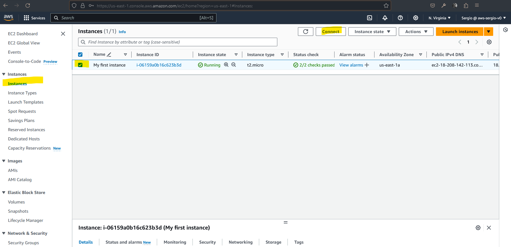

This will open a new tab in your browser as shown below:

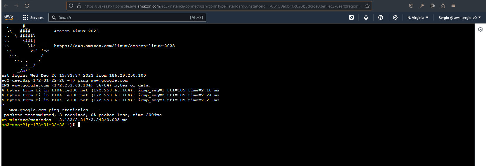

All this rely on SSH; if you go to the security group and remove the SSH rule you won't able to connect to you EC2 instance.

Now, as a rule of thumb, never run the next command in your EC2 Instance Connect:

```sh
aws configure
```

As you notice, this means that if someone have access to our AWS account could retrieve our AWS keys from this EC2 Instance Connect. Instead, you can set up IAM roles. Remember that before we create a `DemoRoleForEC2`. So, let's attach that role to the EC2 Instance. For that, select the instance, click on **Actions > Security > Modify IAM role** as shown the next image:

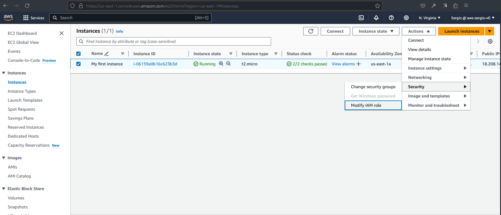

Then select the `DemoRoleForEC2` in the dropdown list:

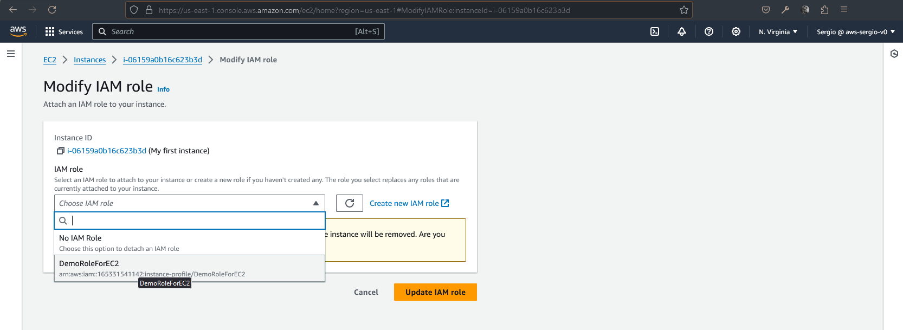

Let's check that the role was attached in the **Security** tab of the EC2 Instance:

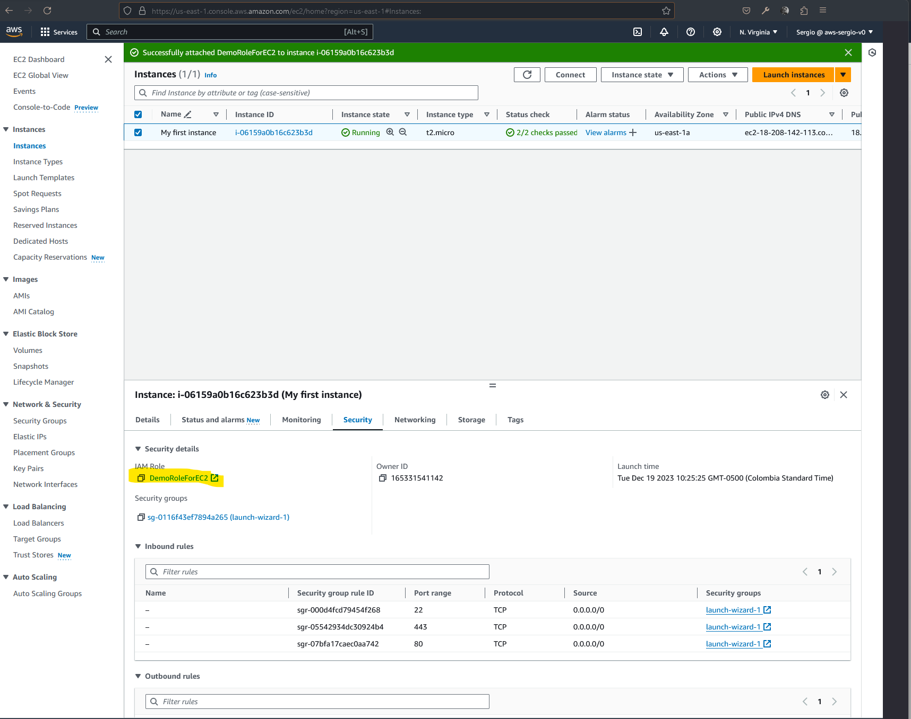

And finally let's run the next command in the browser CLI that is attached to the instance:

```sh
aws iam list-users
```

You should get the next output:

```txt
{
    "Users": [
        {
            "Path": "/",
            "UserName": "admin",
            "UserId": "AIDASM7UHDSLE44C6FZMK",
            "Arn": "arn:aws:iam::165331541142:user/admin",
            "CreateDate": "2023-09-18T13:27:14+00:00"
        },
        {
            "Path": "/",
            "UserName": "Sergio",
            "UserId": "AIDASM7UHDSLPVSI357RA",
            "Arn": "arn:aws:iam::165331541142:user/Sergio",
            "CreateDate": "2023-12-11T02:29:18+00:00",
            "PasswordLastUsed": "2023-12-22T19:51:21+00:00"
        }
    ]
}
```

These are the users associated to that role.

EC2 Purchasing Options
----------------------

So you have the next option for the purchase of your EC2 instances:

- On-demand instance: short workload, predictable pricing, pay by second.
- Reserved: instances for long workloads, convertible for long workloads with flexible instances.
- Saving plans: commitment to an amount of usage, long workload.
- Spot instance: short workloads, cheap, can lose instance.
- Dedicated hosts: book an entire physical server, control instance placement.

So a good analogy is a subscription plan in a resort:

- On-demand instance: coming and staying in resort whenever you like, we pay the full price.
- Reserved: like planning ahead and if we plan to stay for a long time, we may get a good discount.
- Saving plans: pay a certain amount per hour for certain period and stay in any room type.
- Spot instance: the hotel allow people to bid for empty rooms and the highest bidder keeps the rooms. You can get kicked out at any time.
- Dedicated hosts: you book the entire building of the resort.
- Capacity reservations: you bokk a room for a period with full price even you don't stay in it.

EC2 Summary
-----------

- **EC2 Instance:** AMI (OS), instance size (CPU and RAM), storage, security groups, ec2 user data for bootstrap.
- **Security Groups:** Firewall attached to the EC2 instance.
- **EC2 User Data:** Script launched at the first start of an instance.
- **SSH:** Start a terminal into our EC2 instances (port 22).
- **EC2 Instance Role:** link to IAM Roles.
- **Purchasing Options:** On demand, spot, reserved, Dedicated host, dedicated instance.
