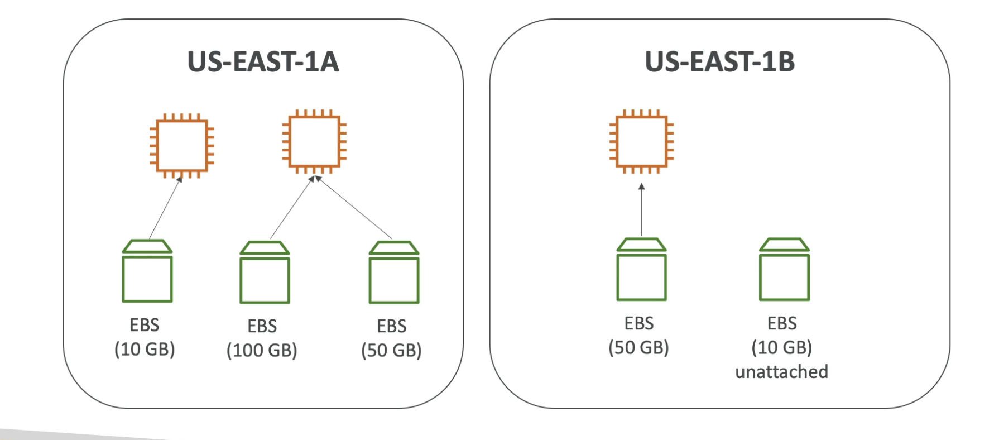
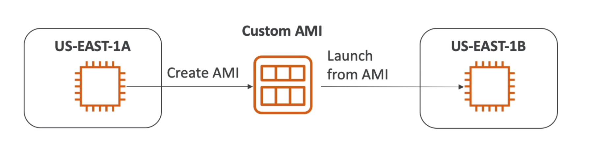

Instance Storage
================

An Elastic Book Store Volume (EBS) is a network drive you can attach to your EC2 instances while they run. It allows your instances to persist data, even after their termination. They can only be mounted to one instance at a time at the Certified Cloud Practitioner level; one EBS can be only mounted to one EC2 instance associate level.

A good analogy is associate an EBS Volume as a network of USB stick. The free tier enable us 30 GB of storage for general purpose per month.

Keep in mind that an EBS Volume is a network drive(i.e., not a physical drive). It uses the network to communicate the instance, which means there might be a bit of latency. Also it can be detached from EC2 instance and attached to another one quicklu.

For other side, the EBS Volume is locked to an Availability Zone (AZ), so an EBS Volume in `us-east-1a` cannot be attached to `us-east-1b`. To move a volume across, you first need to snapshot it.

Lastly, you have a provisioned capacity. You get billed for all the provisioned capacity and you can increase the capacity of the drive over time.

The next diagram is and example of EBS Volume distribution:

It is important to keep in mind the delete on termination attribute. We can control the EBS behaviour when an EC2 instance terminates; by default the root EBS volume is deleted whe the attribute is enable. If it is disabled any another EBS volume is not deleted. They can be controlled by the AWS console and the use case is preserve the root volume when the instance is terminated.

> **About EBS Multi-Attach:** For volumes `io1` and `io2` we have a EBS multi-attach feature. However, from  an AWS Cloud Practitioner exam perspective this out of scope for the exam. In order to keep the course simple and accessible, I have left out this feature from the course. If you are curious to learn about EBS Multi-Attach, you will find it in the AWS Certified Solutions Architect Associate course, or in the AWS documentation.

EBS Snapshots
-------------

A snapshot is a backup of your EBS volume at a point in time. It is not necessary to detach volume to do snapshot, but it is recommended. With a snapshot you can copy them across a availability zone or region. The next image is an example of how we can use a snapshot in two regions.

[EBS Snapshot](../assets/images/03B-ebs-snapshots.png)

The snapshots have the next features:

- EBS snapshot archive allows to move a snapshot to an archive tier that is 75% cheaper. It takes between 24 to 72 hours for restoring the archive.
- Recycle bin for EBS snapshot allows to setup rule to retain deleted snapshots so you can recover them after an accidental deletion.

AMI Overview
------------

Amazon Machine Image (AMI) are customization of a EC2 instance. So, you add your own software, configuration, operation system, monitoring task and so on. An advantage is that the AMI have a faster boot because all your software is pre-packaged.

AMI are build for a specific region and they can be copied across regions. You can launch EC2 instances from three alternatives:

- A public AMI, that is provided by AWS.
- Your own AMI, and you have to created and maintain them yourself.
- An AWS marketplace AMI, that is an AMI that someone else made but it is potentially do for sells.

The AMI process for an EC2 instance is the next one:

1. Start an EC2 instance and customize it.
2. Stop the instance for data integrity.
3. Build an AMI; this will also create EBS snapshots.
4. Launch instance from other AMIs.

The below image summarize this steps:

