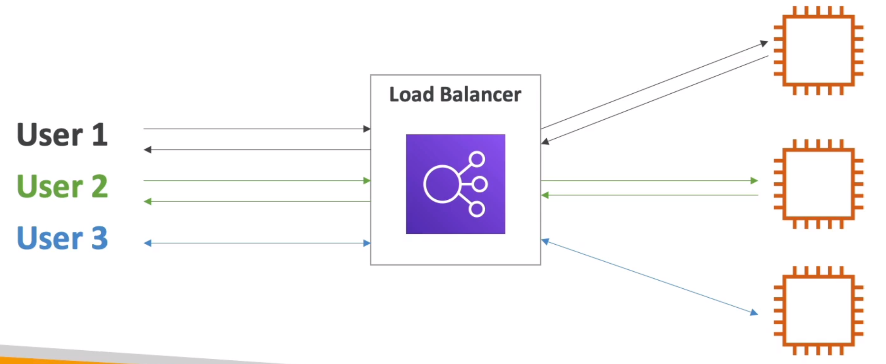
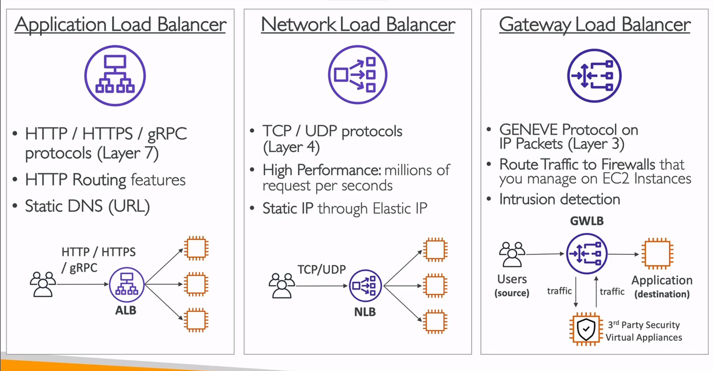

Elastic Load Balancing (ELB) & Auto Scaling Group (ASG)
=======================================================

In this section we will see the power of the AWS cloud, and the cloud in general to check how the concepts of **scalability** and **high availability** shine in our applications.

Let's start with scalability; scalability means that and application can handle greater loads by adapting. We have two kinds of scalability:

- Vertical scalability
- Horizontal scalability

The scalability is linked to availability, but, they are two different concepts. Let's evaluate the two kinds of scalability, using a call center as an example.

In the context of a call center, imagine that we have a junior operator that want to upgrade to a senior operator. Keep in mind that the senior operator can handle a lot more calls that the junior operator because it is more experienced, so this would be a what vertical scalability look like in a call center.

Under the context of AWS, vertical scalability means increasing the size of the instance. Then, if you have an application that runs on a `t2.micro` we are able to scaling this application vertically running it on a `t2.large` instance. This kind of scalability is very common in distributed system such as a database. Usually we have a limit to how much you can vertically scale, and this it the hardware limit.

In the other hand we have the horizontal scalability. So back into the call center example, we have an operator and we want to do horizontal scalability for that operator, that means we will add another operator; if we need to handle more calls we will add another operator, and so on. So we can say that we scale horizontally from 1 operator to 6 operators.

In AWS, horizontal scalability means increasing the number of instance for your application. This implies distributed systems and is very common for web applications. It is easy to horizontally scale thanks the cloud offering such as Amazon EC2 and auto scaling groups.

Let's continue with high availability. Using our call center example, imagine that we have a first building in New York and a second building in San Francisco. Somehow, if one of these call center is down, let's say that there is a power outage in New York, then we can still calls in San Francisco, then we are highly available. Obviously, San Francisco will be more busy, but we are surviving the disaster of a power outage in one of the buildings.

So, you can see that high availability usually goes hand in hand with horizontal scaling. In AWS high availability means running your application in at least 2 availability zones. The goal of high availability is to survive a data center loss (i.e., disaster).

To summarize:

- Vertical scaling increase instance _size_ that it is equivalent to scale up, scale down. (e.g., from `t2.nano` to `u-12tbl.metal`)
- Horizontal scaling increase the _number_ of instance that is equivalent to scale out, scale in (e.g., auto scaling group, load balancer)
- High availability run instance for the same application across multiple availability zones.

Let's end this intro with some important definitions:

**Scalability** is the ability to accommodate a larger load by making hardware stronger (scale up), or by adding nodes (scale out).

Once a system is scalable, **elasticity** means that there will be some auto-scaling so that the system can scale based on the load. This is cloud-friendly, pay per use, match on demand and optimize costs.

**Agility**, that is not related to scalability and sometimes is a distract, are new IT resources that are only a click away, which means that you reduce the time to make those resources available to your developers from weeks to just minutes.

Elastic Load Balancer (ELB) Overview
-------------------------------------

A load balancer are servers that forward internet traffic to multiple server (e.g., EC2 instances) downstream. The next illustration show how the load balancer distribute the traffic according the consulting user:

The benefits of use a load balancer are several; It helps to spread load across multiple downstream instances, exposing a single point of access (i.e., DNS) to your application. Also, yu can seamlessly handle failures of downstream instances doing regular health checks to them. It provides SSL termination vias HTTPS for your websites allowing high availability across zones.

Now, under the context of AWS we have the ELB that is a managed load balancer where AWS guarantees that it will be working, take care of upgrades, maintenance and high availability and provides few configuration knobs. A warning is that use ELB cost less to setup your own load balancer but it will be a lot more effort on your end (i.e., maintenance and integrations).

AWS offer 4 kinds of load balancers:

1. Application load balancer.
2. Network load balancer.
3. Gateway load balancer.
4. Classic load balancer (retired on 2023).

The next image summarize the difference between the not retired load balancers:

