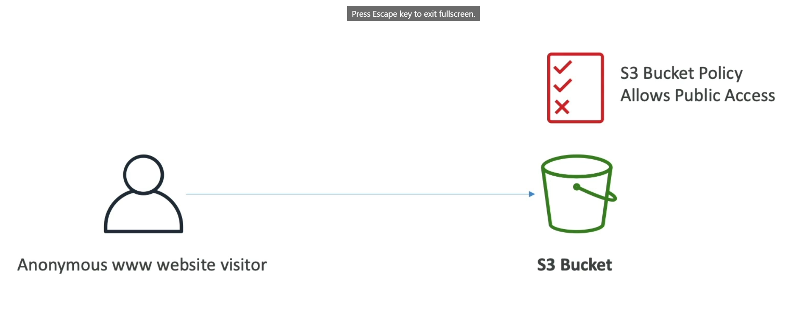
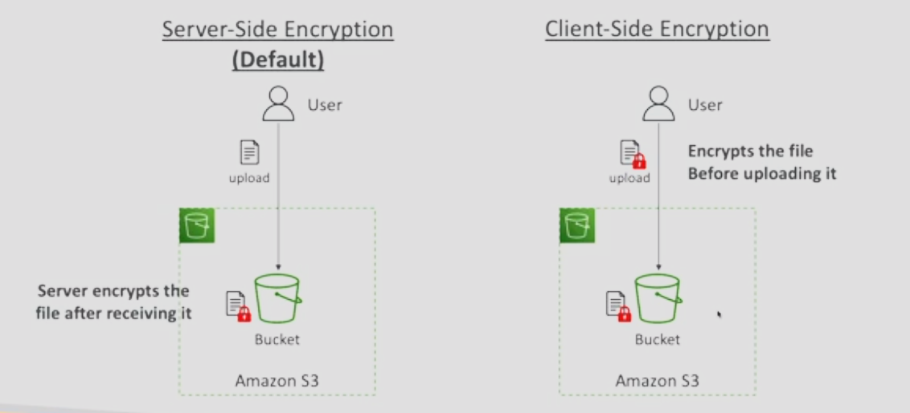
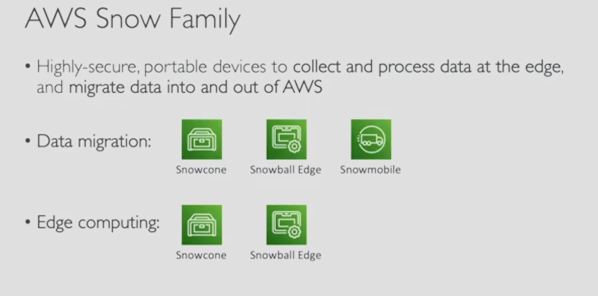
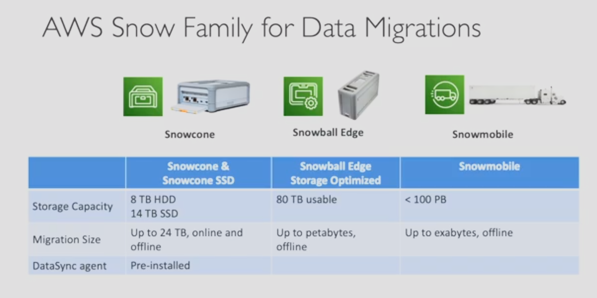
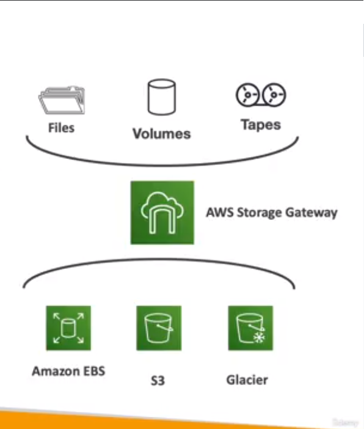

Amazon S3
=========

Amazon S3 is one of the main building block of AWS, and it is advertised as _infinitely scaling_ storage. Many websites use it as a backbone and a lot of AWS services use it for integration, so it is important have a step by step approach to S3.

There are several use cases for Amazon S3:

- backup and storage.
- disaster recovery.
- archive.
- hybrid cloud storage.
- application hosting.
- media hosting.
- data lakes.
- software delivery.
- static website.

To mention some specific cases, Nasdaq stores 7 years of data in S3 glacier and Sysco runs analytics on its data and gain business insights.

The key elements of Amazon S3 allows to store **objects/files** in **buckets/directories**. The buckets must have a _globally unique name_  across all regions and all accounts and they are defined at the region level. S3 looks like a global service but buckets are created in a regions using a specific naming convention.

In the other hand, we have objects. They have a key that is the full path (e.g., `s3://my-bucket/my_file.txt`). The key is composed of a prefix (directory path) and an object name (file name). There is no concept of directories within buckets but the UI will trick you to think otherwise. The object values are the content of the body, they have a maximum size of 5000 GB. So, if you pass this limit you must use a _multi-part upload_. They also are compose of metadata, tags and if you enable it versioning.

S3 Security
-----------

We can define the access to the buckets that stored in S3. One way is use a **user based** condition with IAM policies stablish which API calls should be allowed for a specific user from IAM. Another way is the **resource based** condition where we can define the next 3 scenarios:

1. Bucket policies; bucket wide rule from the S3 console, allowing cross account.
2. Object access control list (ACL); finer grain because is an object level. It can be disabled.
3. Bucket access control list (ACL); less common because is an bucket level. It can be disabled.

Keep in mind that an IAM principal can access a S3 object if they have the permissions or the resource policy allows it. Bu default there is a no explicit deny with IAM.

Besides, you can also **encrypt** objects in S3 via encryption keys.

The bucket policies are the most popular and they are recorded in a JSON file like the next one:

```json
{
    "Version": "2020-10-17",
    "Statement": [
        {
            "Sid": "PublicRead",
            "Effect": "Allow",          // Allow or Deny
            "Principal": "*",           // The account to apply the policy
            "Action": [
                "s3:GetObject"          // Set of API to allow or deny
            ],
            "Resource": [
                "arn:aws:s3:::bucket/*" // Buckets and object
            ]
        }
    ]
}
```

So you can use a bucket policy to grant public access to the bucket, force objects to be encrypted at upload or grand access to another account. Below an image to illustrate the use of a bucket policy;



A last option are the bucket settings for block public access. These settings were created to prevent company data leaks, so, if you know your bucket should never be public leave these on. they can be set at account level.

S3 Static Website Hosting
-------------------------

S3 can host static web sites and have them accessible on the Internet. The website URL will be defined by the region and some example are:

- http://{{bucket_name}}.s3-website-{{aws_region}}.amazonaws.com
- http://{{bucket_name}}.s3-website.{{aws_region}}.amazonaws.com

If you get a **403 Forbidden error**, make sure the bucket policy allows public reads.

S3 Versioning
-------------

You can version your files in Amazon S3. This feature is enable at the _bucket level_. The same key will change the "version". It is a best practice to version your bucket because it allows you to protect against unintended delete; now you have the ability to restore versions. And also is easy roll back to previous version of the file.

Some notes are important to share; any file that is not versioned prior to enabling versioning will have the `null` values. Suspending versioning does not delete the previous version of the file.

S3 Replication
--------------

The idea behind replication is have a S3 bucket in one region and a target S3 bucket in another region via asynchronous replication between these two bucket. To do it we must enable versioning in the source and the destination bucket. We can apply the replication in two flavors:

- Cross-Region Replication (a.k.a CRR): for compliance, lower latency, access, replication across accounts.
- Same-Region Replication (a.k.a SRR): for log aggregation, live replication between production and test accounts.

Their names are self-explanatory, and also we share their use cases. Then it's possible to have these buckets in different AWS accounts and copying happens asynchronously. So the replication mechanism happens in the background. To make replication work, you must give proper IAM permissions to the S3 service.

S3 Storage Classes
------------------

There are two concept you have to keep in mind when you deal with S3 storage classes: _durability_ and _availability_:

**Durability** is measure with 9 and percentages to calculate the average expect to incur a loss of an object in Amazon S3. High durability of objects across multiple availabilities zones is around 99.99999999% (11 9's ). So if you store 10,000,000 objects with Amazon S3, you can on average expect to incur a loss of a 1 object once every 10,000 years. Durability is the same for all storage classes.

In the other hand, **availability** measures how readily available a service is and it varies depending on storage class. For example, the Amazon S3 standard storage class has 99.99% of availability; this means that it will be not available 53 minutes in a year.

For detailed information about the Amazon S3 Storage Classes please read the respective [docs](https://aws.amazon.com/s3/storage-classes/) about them.

S3 Encryption
-------------

The next image summarize the two mechanism that we have with Amazon S3 to encrypt the files stored on it:



IAM Access Analyzer for S3
--------------------------

With IAM Access Analyzer you can ensure that only intended people have access to you S3 buckets. For example publicly accessible bucket, bucket shared with other AWS account, etc. With the analyzer you can evaluate the S3 buckets policies, S3 ACLs, S3 access point policies and then determine if everything is OK.

Share Responsibility Model for S3
---------------------------------

AWS's responsibilities:

- Infrastructure (global security, durability, availability, sustain concurrent loss of data in two facilities)
- Configuration and vulnerability analysis
- Compliance validation

User's responsibilities:

- S3 versioning
- S3 bucket policies
- S3 replication setup
- Logging and monitoring
- S3 storage classes
- Data encryption at rest in transit

AWS Snow Family
---------------

The AWS snow family is a highly-secure, portable devices with two use cases:

1. Migrate data into and out of AWS
2. Collect and process data at the edge

The next image sumarizes the services fo each case:



Let's start with the _data migration_ products. By rule of thumb, if a data migration takes more than a week to transfer over the network, then use the snowball devices. Below, a table that recaps the different features of the snowball devices.



The snow family have the next usage process:

1. Request snowball devices from the AWS console for delivery.
2. Install the snowball client (a.k.a. AWS OpsHub) on your servers.
3. Connect the snowball to your servers and copy files using the client.
4. Ship back the device when you are done.
5. Data will be loaded into an S3 bucket.
6. Snowball is completely wiped.

Now, let's review with the _edge computing_. In short, edge computing is the process of data in edge location; an edge location is a location where you may have a limited / no internet access or limited / no easy access to computing power (e.g., a truck on the road, a ship on the sea, a mining station underground, etc.)

Then, you can setup a snowball edge / snowcone device to do edge computing and preprocessed data, machine learning at the edge or transcoding media streams. This devices comes in two flavors:

1. Compute optimized.
2. Storage optimized.

According your context, you do a choice.

Historically, to use snow family devices, you needed a CLI; today you can use the **AWS OpsHub** a software you install on your computer to manage your snow family devices.

About pricing, you pay for _device usage_ and _data transfer_ out of AWS. If the data transfer is to Amazon S# is $0.00 per GB. For device usage you have the **on-demand** option that includes one-time service fee per job with range between 10-15 days of usage for edge storage optimized 80-219 TB. Shipping days are not counted and you pay per day for any additional days.

In the other hand, you have the **committed upfront** option, paying in advance for monthly, 1 or 3 years of usage for edge computing. This alternative offer up to 62% of discounted pricing.

Storage Gateway
---------------

AWS is pushing for _hybrid cloud_; this means have part of your infrastructure is on-premises and other part is on the cloud. This can be due to long cloud migrations, security requirements, compliance requirements and IT strategy. S3 is a proprietary storage technology, so how dow you expose the S3 data on premise? The answer is the storage gateway as show the next image:



Store gateway is a bridge between on-premise data and cloud data in S3. Their use cases are disaster recovery, backup/restore and tiered storage.

Summary
-------

- _Buckets vs Objects:_ global unique name tied to a region.
- _S3 Security:_ IAM policy, S3 bucket policy, S3 encryption.
- _S3 Websites:_ host a static website on Amazon S3.
- _S3 Replication:_ same region or cross-region, must enable versioning.
- _S3 Storage Classes:_ standard, IA, IZ-IA, intelligent, glacier.
- _Snow Family:_ import data onto s3 through a physical device, edge computing
- _OpsHub:_ desktop application to manage snow family devices
- _Storage Gateway:_ hybrid solution to extend on-premises storage to S3.
