Databases & Analytics
=====================

Storing data on disk (e.g., EFS, EBS, EC2 instance store or S3) have their limits. Sometimes you will need to have a structure in the data to build **indexes** and enable **queries** or **search** through the data. For this use case, it is better store the data in a database. Here you can define relationships between your datasets.

Database are optimized for a purpose and come with different feature, shapes and constraints.

You will find to types of databases:

- SQL (i.e., Structured Query Language) databases.
- No-SQL databases.

SQL databases (a.k.a relational databases) looks like excel spreadsheets with links between them. They have a key feature and is that you can use the SQL language to preform queries or lookups over the database. The next image is an example of a relational database:

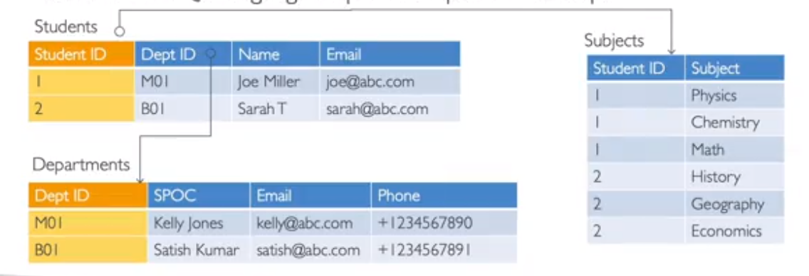

No-SQL databases (a.k.a non-relational databases) have a purpose build specific data models with flexible schemas for building modern applications. An schema is the shape of the data. They offer benefits like flexibility, scalability, high-performance and highly functional. As example we have a JSON model as shown below:

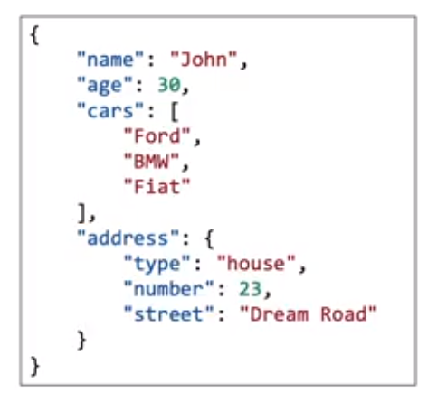

They can be key-value pairs, documents, graphs, in-memory or search databases.

AWS offers use to manage different databases with the next benefits:

- Quick provisioning.
- High availability.
- Vertical and horizontal scaling
- Automated backup and restore.
- Operations and upgrades
- Operating system patching
- Monitoring and alerting.

> Note: many database technologies could run on EC2, but you must handle yourself the resiliency, backup, patching, availability, and other features of your database.

Amazon RDS
----------

RDS stands for Relational Database Service. So this is a managed database service for databases that use SQL as query language. It supports: Postgres, MySQL, MariaDB, Oracle, Microsoft SQL Server, IBM DB2 and Aurora. Aurora is proprietary of AWS and we will review more about it later. So, with this service we can:

- Automated provisioning.
- OS patching.
- Continuos backups and restore to specific timestamp (i.e., point in time restore).
- Monitoring dashboards.
- Read replicas for improved read performance.
- Multi AZ setup for disaster recovery.
- Maintenance windows for upgrades.
- Scaling capability.
- Storage backed by EBS.

> Note: You cannot use SSH (Secure Shell Protocol) into your RDS instances.

The next image summarizes the RDS solution architecture:

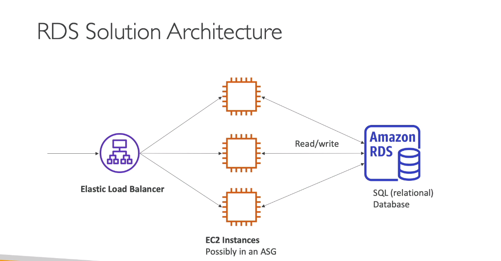

Now, let's talk about **Aurora**, that is a proprietary not open sourced technology from AWS that only supports Postgres and MySQL for offer a AWS cloud optimized service and claims 5x performance improvement over MySQL on RDS and 3x of performance on RDS. Aurora is not in the free tier and storage automatically grows in increment of 10GB, up to 128TB. It cost 20% more than RDS, but it is mor efficient.

There is also **Aurora Serverless** that is and automated database instantiation and auto-scaling based on actual usage. No capacity planning is needed and it is least management overhead. You can pay per second to be more cost effective.

The use cases are: good for infrequent, intermittent or unpredictable workloads

RDS Deployment
--------------

We have three types of deployments in RDS:

1. Read replicas.
2. Multi-AZ.
3. Multi-Region.

**Read replicas** help us to scale the read workload of the database. You can create up to 15 read replicas of the main RDS. Keep in mind that the data is only written to the main database. The next image illustrates the distribution of a read replicas deployment:

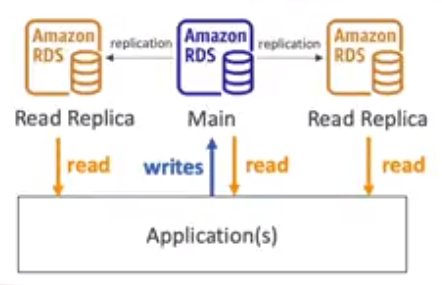

**Multi-AZ** is used to _failover- in case of availability zone outage, guarantee high availability in the database. The data is only read/written to the main database and you can only have 1 other AZ as failover. Below an example of a multi-AZ deployment:

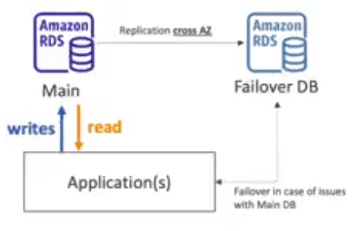

Finally, we have the **multi-region** deployment. His use case is for _disaster recovery_ in case of a region issue. Due to his distribution you will have _local performance_ for global reads, but, you will pay with replication cost. The following image show a map of a multi-region deployment.

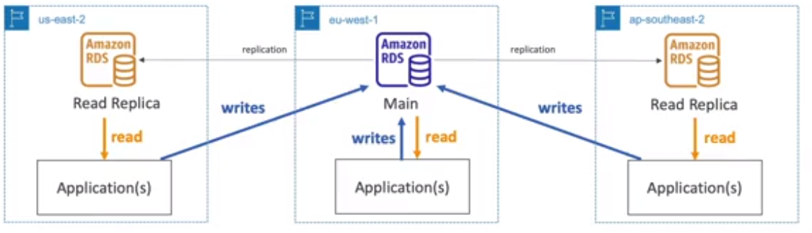

ElastiCache
-----------

ElastiCache is the option to handle _in-memory databases_. In the same way RDS is to get managed relational database, ElastiCache is to get manage Redis or Memcached. These caches are in-memory databases with high performance and low latency to reduce load off databases for read intensive workloads.

Similarly, to RDS with ElastiCache AWS takes care of OS maintenance / patching, optimizations, setup, configuration, monitoring, failure recovery and backups.

Below and image of an architecture with a cache databes:

DynamoDB
--------

DynamoDB is a fully managed highly available NoSQL database with replication across 3 AZ. It scales to massive workloads, distributed _serverless_ database, processing millions of requests per second, trillions of row around 100 second of TB storage. Guaranties fast and consistent performance with a single-digit millisecond latency (i.e., low latency retrieval). Also it is integrated with IAM for security, authorization and administration.

Below is an image with the type of data that handle a DynamoDB:

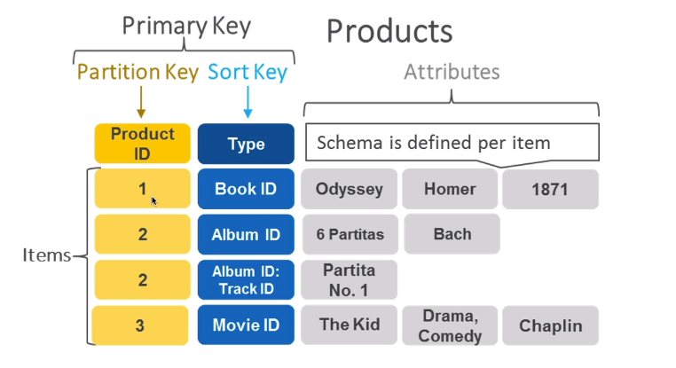

Additionally, you can add the **DynamoDB Accelerator (a.k.a. DAX)**, that is a fully managed in-memory cache for DynamoDB, offering **10x performance improvement**, converting a single-digit millisecond latency to microseconds latency when accessing your DynamoDB tables. This offers a secure and highly scalable/available database. The difference with ElastiCache at cloud computing platform level is that DAX is only used for and is integrated with DynamoDB, while ElastiCache can be used for other databases.

The next image is an architecture that use DAX in the middle of the application and a DynamoDB.

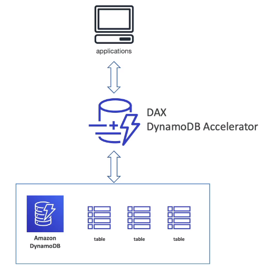

Finally, lets review the **DynamoDB global tables**. The purpose of a global table is make it accessible with **low latency** in multiple regions. They use the **active-active** replications that implies the the read and write operations could be done in any AWS region. The next images is an example of a global table that is replicate in N. Virginia and Pairs:

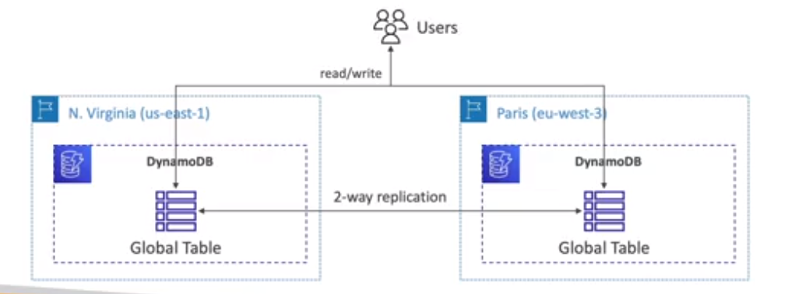

Redshift
--------

Redshift is based on PostgreSQL used for **online analytical processing (OLAP in short)** for execute analytics and data warehousing. It loads data once every hour and have 10x better performance than other data warehouses scaling to petabytes of data. Use columnar storage of data instead of row based offering massively parallel query execution (MPP in short) and highly availability. Pay as you go based on the instances provisioned and has a SQL interface for perming the queries. Lastly, business intelligence tools such AWS Quicksight or Tableu integrate with it.

Complementary you can setup automatically provisions and scales data warehouse unrlying capacity with **Redshift Serverless**. Moreover, you can run analytics workloads without managing the data warehouse infrastructure, paying only for what you use.

The common use cases of Redshift Serverless are: reporting, manage dashboard applications, and realtime analytics.

Below it is a diagram with the sequence to setup Redshift Serverless:

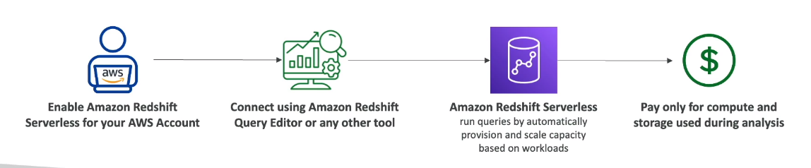

Amazon EMR
----------

EMR stands for Elastic MapReduce, and it helps creating **Hadoop Clusters** to analyze and process vast amount of data. Keep in mind the Apache Hadoop is a collection of open-source software utilities that facilitates using a network of many computers to solve problems involving massive amounts of data and computation.

The clusters can be made of hundreds of EC2 instances, and also supports Apache Spark, HBase, Presto and Flink. EMR takes care of all the provisioning and configuration in AWS offering auto-scaling and integrations with Spot instances.

The use cases are: data processing, machine learning, web indexing and big data.

Amazon Athena
-------------

Athena is a serverless query service to perform analytics against S3 objects via SQL language to query the files. It supports CSVm JSON, ORC, AVRO and Parquet,

The pricing is $5.00 per terabyte of data scanned and it use compressed or columnar data for cost saving.

The use cases are: business intelligence, analytics, reporting, analyze and query VPC flow logs, ELB logs and cloud trail.

The next image illustrate the responsibilities of each service according and specific action:

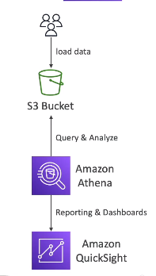

Amazon QuickSight
-----------------

Quicksight is a serverless machine learning powered business intelligence service to create interactive dashboard like the next one:

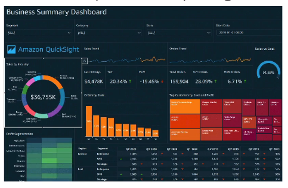

It is fast, automatically scalable, embeddable with a price per session. It can be integrated with RDS, Aurora, Athena, Redshigt and S3.

Their use cases are: business analytics, building visualization, perform ad-hoc analysis and get business insight using data.
