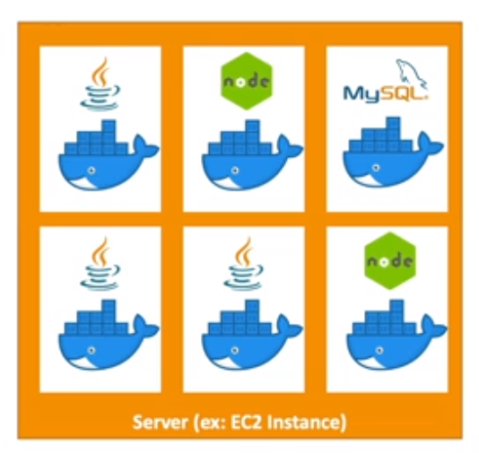
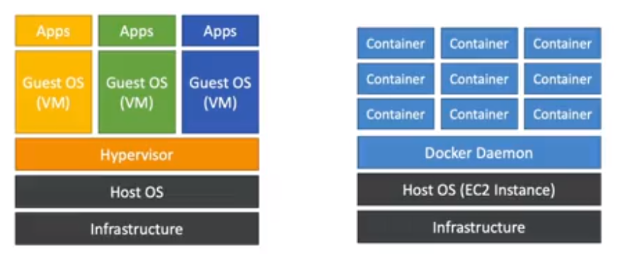
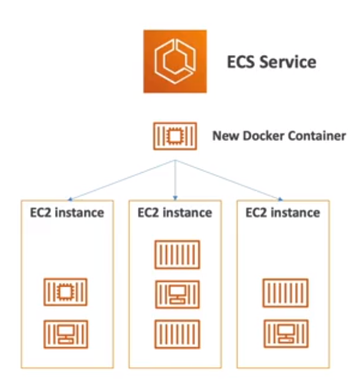
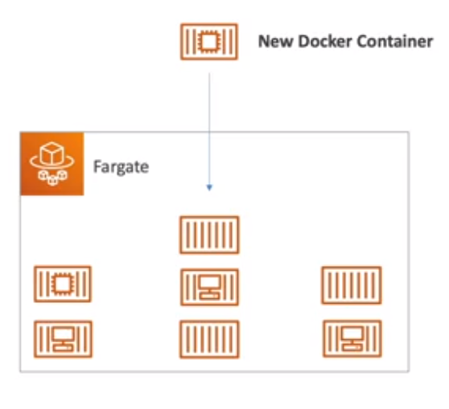
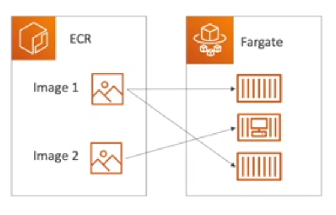
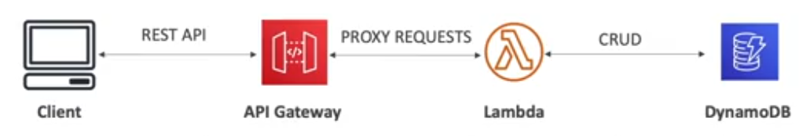

Other Compute Services
======================

What is Docker?
---------------

Docker is a software development platform to deploy application. The applications are package in **containers** thath can be run on any operating system. The application run the same, regardless of where ther are run:

- Any machine.
- No compatibility issues.
- Predictable behavior.
- Less work.
- Easier to maintain.
- Works with any language, any OS and on any technology.

A big win of docket is that you can scale containers up and dow very quickly (i.e., seconds). The next image is a example of a several docker containers with different technologies on a EC2 instance server.

The docker images are stored in docker repositories that can be:

- Public: Docker hub.
- Private: Amazon Elastic Container Registry.

Docker is a sort of a virtualization technology, but not exactly. The resources are shared with the host in the case of virtual machines, while with docker many container are on one server. The next image illustrates the difference between a virtual machine and docker.

> Note: This is a light introduction to docker but is necessary to get into the amazon ECS.

Elastic Container Service
-------------------------

Elastic Container Service (ECS in short) launch docker containers on AWS. Here you must provision and maintain the infrastructure of only EC2 instances. AWS takes care of starting/stopping containers ad it has integrations with the Application Load Balancer. The next diagram shows a structure of ECS.

Fargate
-------

Fargate also works to launch docker container on AWS but it is much simpler because you do not provision the infrastructure because ther is no EC2 instance to manage. It is serverless offering and AWS just runs containers based on the CPU/RAM you need. The next image show the distribution of docker containers with fargate.

Elastic Container Registry
--------------------------

Elastic Container Registry (ECR in short) is a private docker registry on AWS to store your docker image. So they can be run by ECS or Fargate as shown the next illustration:

Serverless
----------

Serverless is a new paradigm in which developers do not have to manage servers anymore. They just deploy code and in a more concise way, they just deply **functions**. Initially it was equivalent to say the Serverless is Function as a Service (FaaS in shore). It was pioneered by AWS Lambda but now it also includes anything that is manages; databases, messaging, storages, etc.

Serverless does not mean there are no servers, it means you just don't manage, provision or see them as developer.

So far, these are the serverless service that we already review:

- Amazon S3, for storage.
- DynamoDB, for relational databases.
- Fargate, for launch locker containers.

However, the most popular serverless services is pending to review, the **Lambda** service.

AWS Lambda
----------

A good introduction to Amazon Lambda is a comparison with Amazon EC2. Remember that in the context of EC2 we have:

- Virtual servers in the cloud.
- Limited by RAM and CPU.
- Continuously running.
- Scaling means intervention to add / remove servers.

Under the context of Lambda we have:

- Virtual functions! i.e., no servers to manage.
- Limited by time i.e, short execution.
- Run **on-demand**.
- Scaling is automated.

So, we this approach is evident the benefits of Lambda. Here we got a easy pricing under a pay per request and compute time. It is integrated with the whole AWS suite of services. It is **event-driven**, so the functions are invoked by AWs when needed. It is integrated with manu programming languages. You can monitoring through AWS CloudWatch. And last but no least, it enables get more resources per function (up to 10 gigabytes of RAM) making that increasing RAMM will also improve CPU and Network.

An example of use case for AWS Lambda is:

1. Load a new image to S3.
2. S3 trigger a Lambda function.
3. This function creates a thumbnail of the image loaded.
4. The thumbnail is stored int S3.
5. The metadata of the image is stored in DynamoDB.

Another common use case are the CRON jobs, to excute the function after a period of tame (e.g., each hour.),

It is important to highlight that Lambda pricing could be per **calls**, so your first 1k request are free, then you pay $0.20 per 1 millions request, or per **duration** in increments of 1 millisecond. The conclusion is: AWS Lambda usually is very cheap so it's very popular.

API Gateway
-----------

API Gateway is a fully managed service for developers to easily create, publish, maintain, monitor and secure APIs. It is serverless and scalable to supports RESTful APIs and WebSocket APIs with security, user authentication, API throttling, API keys and more.

The most common use case is build a serverless API as show the next image:

