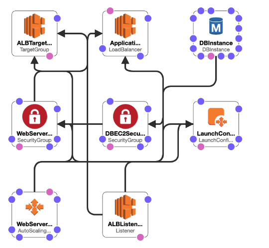

Deployments and Managing Infrastructure at Scale
================================================

Cloud Formation
---------------

Cloud formation is a declarative way of outlining your AWS infrastructure for any resources.

