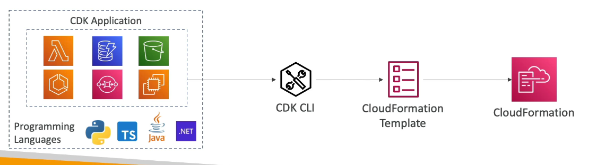

Deployments and Managing Infrastructure at Scale
================================================

Cloud Formation
---------------

Cloud formation is a declarative way of outlining your AWS infrastructure for any resources. So you can create templates like the next want:

- I want a security group;
- I want two EC2 instances using the security group;
- I want an S3 bucket;
- I want a ELB load balances in front to these machines.

Then, Cloud Formation create those for you in the **right order** with the exact configuration that you specify.

This offer us several benefits. The first one is **Infrastructure as Code** where no resources are manually created, which is excellent for control and the changes to the infrastructure are reviewed through code.

The second one is **cost**. Each resource within the stack is tagger with an identifier so you can easily see how much a stack cost you; You cans estimate the costs of your resources using the Cloud Formation template under a saving strategy. This means, you can specify that the development environment have an automated task to delete the templates at 5 PM and recreated at 8 AM safely.

The third one is **productivity**; the ability to destroy and re-create an infrastructure on the cloud on the fly, plus an automated generation of diagram for your templates! Also you approach is declarative so you no need to figure out ordering and orchestration.

The fourth is **don't re-invent the wheel** leverage existing template on the web in combo with their documentation.

Lastly, it **supports (almost) all AWS resources**; Everything we will see until now is supported and you can use custom resources for those that are not supported.

The next image groups a WordPress cloud formation stack with all the resources and the relations between the components.


Cloud Development Kit
---------------------

Cloud Development Kit (CDK in short) is a tool to define you cloud infrastructure using a familiar programming language. These code is compiled into a CloudFormation template in a JSON/YALM format. Therefore you can deploy infrastructure and application runtime code together, making this combination great for lambda function and docker containers in ECS/EKS.

The next diagram summarize how works the CDK:



The next example is a code infrastructure definition in TypeScript:

```js
export class MyEcsConstructStack extends core.Stack {
  constructor(
    score: core.App,
    id: string,
    props: core.StackProps
  ) {
    super(scope, id, props)
  }

  const vpc = new ec2.Vpc(this, "MyVpc", {
    maxAzs: 3
  });

  const cluster = new ecs.Cluster(this, "MyCluster", {
    vpc: vpc
  });

  new ecs_patterns.ApplicationLoadBalancedFargateService(this, "MyAL", {
    cluster: cluster,
    cpu: 512,
    desiredCount: 6,
    taskImageOption: {}
    memoryLimitMiB: 2048,
    publicLoadBalance: true
  });
}
```

Beanstalk
---------

Below, we have a typical 3 tier architecture for web application deployed in AWS:


You can manage manually this infrastructure but keep in mind that as developer you always are looking for the next action:

> All the developer want is for their code to run!

Most of the web apps have the same architecture showed in the last image. Here is where Beanstalk comes. Elastic Beanstalk is a developer centric view of deploying an application on AWS. It uses all the components we have seen before, but it is all in one views that is easy to make sense of keeping full control over the configuration. So Beanstalk is **Platform as a Service**. Initially its free, but you have to pay for the underlying instances.

As service Beanstalk is capable of:

- Instance configuration and the OS is handled by Beanstalk.
- Deployment strategy is configurable but performed by Beanstalk.
- Capacity provisioning.
- Load balancing and auto-scaling.
- Application health monitoring and responsiveness.

With this just the application code is responsibility of the developer.

It offers 3 architecture models:

1. Single instances deployment, good for development environments
2. Load balances + Auto scale group, good for web apps in pre production and production environments.
3. Auto scale group, good for non web apps in production (e.g., workers)

Lastly, Beanstalk offer you health monitoring via and agent that pushes metrics to CloudWatch. It checks for app health, publishes health events.

Code Deploy
-----------

Code Deploy is a service to deploy our application automatically. It works with EC2 instances and on-premises servers. This means that it is an hybrid services. The servers or instances must be provisioned and configured ahead of time with the code deploy agent. A common use is the update versions between servers/instances as show the next image:


