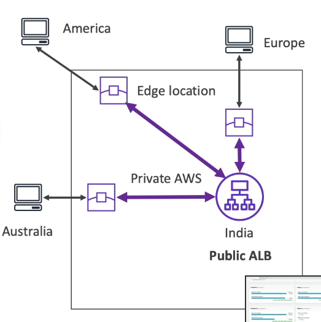
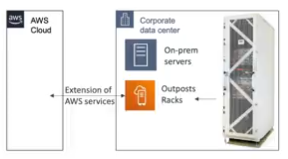

Global Infrastructure
=====================

A global application is an application deployed in multiple geographies. In AWS we have regions and edge location. This action offer us 3 benefits:

1. **Decreased latency:** Latency is the time it takes for a network packet to reach a server. It takes time for a packet from Asia to reach the US. Deploy your application closer to your users decrease latency offering a better experience.
2. **Disaster recovery:** If and AWS region goes down (earthquake, storms, power shutdown, etc.) you can fail over to another region and have your application still working. A disaster recovery plan is important to increases the availability of your application.
3. **Attack protection:** A distributed global infrastructure is harder to attack.

Index
-----

- **Route 53 (Global DNS)**: Great to route users to the closes deployment with least latency and disaster recovery strategies.
- **Cloud Front (Global CDN)**: Replicate part of your application to AWS edge locations and cache common request to decrease latency.
- **S3 Transfer Acceleration**: Accelerate global uploads and downloads into Amazon S3.
- **AWS Global Accelerator**: Improve global application availability and performance using AWS global network.

Route 53
--------

Route 53 is a managed domain name system (in short DNS). DNS is a collection of rules and records which helps clients understand how to reach a server through URLs. In AWS, te mos common records are:

- <www.google.com> -> 12.34.56.78 == A record in IPv4
- <www.google.com> -> 2001:0db8:85a3:0000:0000:8a2e:0370:7334 == A record in IPv6
- search.google.com -> <www.google.com> =- CNAME: hostname to hostname

The next diagram summarize how the DNS works.

We have to keep in mind a high level of the routing policies explainend in the next 2 images.

Just a first one does not have a Health check. All the other ones have Health checks and they all serve different purposes. So, weighted routing policy is to distribute the traffic across multiple institute instances. Latency is to minimize latency and failover is to help with disaster recovery.

Cloud Front
-----------

Cloud front is a content delivery network (in short CDN). It improves read performance, because the content is cached at the edge location improving the user experience. It has 216 point of presence globally and offer us distributed denial of service (DDoS) protection because it is worldwide and works in combo with shield and AWS web application firewall.

Cloud front could have two origins; S3 bucket or custom HTTP origin. The S3 bucket origin is used for distributing files and caching them at the edge enhancing security with origin access control (OAC). Then we can use cloud front as an ingress to upload files to S3. The next image maps this description:

For custom origin we can use cloud front as application load balancer, a copy of a EC2 instance or a S3 website enabling first the bucket as static.

With this description is common get confusions between cloud front and S3 cross origin replication. Below is a list with the difference between them.

Cloud front:

- Global edge network.
- Files are cached for a TTL.
- Great for static content that must be available everywhere.

S3 cross region replication:

- Must be set up for each region you want to replication happen.
- File are updated in near real-time.
- Read only.
- Great for dynamic content that needs to be available at low latency in few regions.

S3 Transfer Acceleration
------------------------

This service increase the transfer speed by moving the file to an AWS edge location which will forward the data to the S3 bucket in the target region. The next image map this behavior:

The cool thing is that there is a [S3 Transfer Accelerator tool](http://s3-accelerate-speedtest.s3-accelerate.amazonaws.com/en/accelerate-speed-comparsion.html) to test.

AWS Global Accelerator
----------------------

The global accelerator improve the **availability** and **performance** of an application using the AWS network. It leverage the AWS internal network to optimize the route to you application reaching until 60% of improvement. It creates 2 anycast IP for your application and traffic is sent through edge location. The edge locations send the traffic to your application. The next image illustrate this description:

There is a confusion between global accelerator and cloud front. They both use the AWS global network and its edge locations around the world. Also, they are integrated with AWS shield for DDoS protection. However:

Cloud front - content delivery network

- Improves performance for your cacheable content (such as images and videos)
- Content is served at the edge

While global accelerator:

- No caching, proxying packets at the edge to applications running in one or more AWS regions.
- Improves performance for a wide range of applications over TCP or UDP.
- Good for HTTP use cases that require static IP addresses.
- Good for HTTP use cases that require deterministic, fast regional failover.

Similar to transfer acceleration, we have a tool to measure the time consumed for [AWS Global Accelerator](https://speedtest.globalaccelerator.aws/#/) to load a file. The invitation is open to do your test.

AWS Outposts
------------

Outposts service has relevance when we talking about hybrid cloud. Hybrid cloud are businesses that keep an on premises infrastructure alongside a cloud infrastructure. Therefore, we have two ways of dealing with IT systems:

- One for the AWS cloud (using the AWS console, CLI, and AWS APIs).
- One for their on premises infrastructure.

AWS outposts are **server racks** that offers the same AWS infrastructure, services APIs & tools to build your own applications on premises just as in the cloud. So AWS will set up and manage outposts racks within your on premises infrastructure and you can start leveraging AWS service on premises. Now, you are responsible for the outposts racks physical security. The next images show the interactions in a hybrid cloud.

Below a list of the benefit of use outposts:

- Low latency access to on premises systems.
- Local data processing.
- Data residency.
- Easier migration from on premises to the cloud.
- Fully managed service.
- There are several services of the AWS ecosystem that works on it.
