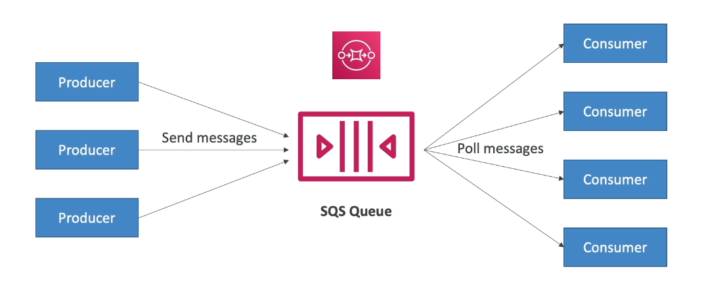
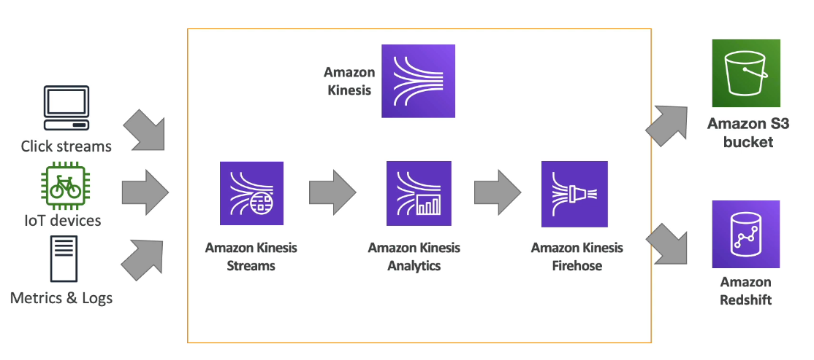
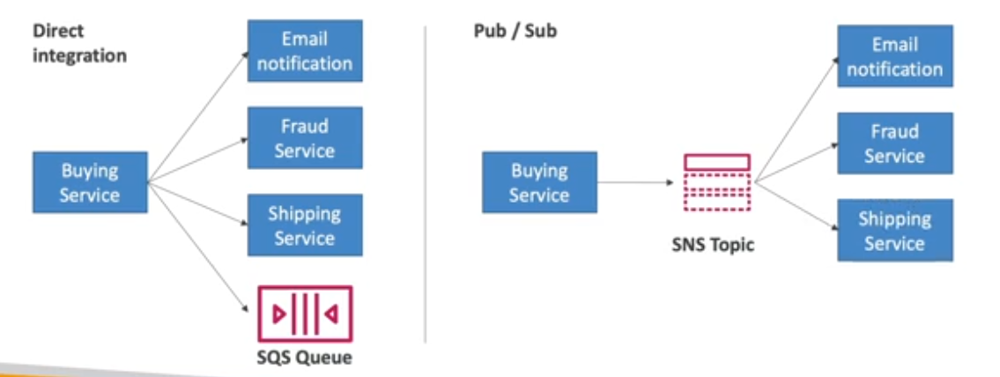

Cloud Integrations
==================

When we start to deploying multiple applications, they will inevitably need to communicate with one another. There are two patterns of application communication:

1. Synchronous communication, application to application.
2. Asynchronous / event based communication, application to queue to application.

The synchronous communication can be problematic if there are sudden spikes of traffic. In that case, it is better to decouple applications using some of the next 3 services:

1. SQS for queue model.
2. SNS for public/subscription model.
3. Kinesis for real time data streaming model.

These services can scale independently from the application.

Simple Queue Service
--------------------

Simple Queue Service is probably the oldest service of AWS. It is a fully managed service use to **decouple** applications. It scales from 1 message per second to 10,000s per second. It has a default retention of 4 days with a maximum of 14. There is no limit to how many messages can be in the queue and the message are deleted after they are read by consumers. It has a low latency with a publish and receiver rate below to the 10 milliseconds and  the consumers share the work to read messages for scaling horizontally.

The next image show how SQS works in a nutshell:

This queue can be a first in firs out where the message are ordering in the queue to be processed in order by the consumer.

Kinesis
-------

Kinesis is a service to handle real time big data streaming. It collect, process and analyze real time streaming data at any scale and is composed by:

- Data Streams; they are low latency streaming to ingest data at scale from hundreds od thousands of sources.
- Data Firehose; it loads streams into S3, Redshift, ElasticSearch, etc.
- Data Analytics: it performs real time analytics on streams using SQL.
- Video Streams: it monitor real time video streams for analytics or machine learning.

The next image is a high level view of kinesis.

Simple Notification Service
---------------------------

Simple Notification service solve the scenario when you want to send one message to many receivers. The event **publishers** only send message to a **SNS topic** and the event **subscribers** that could be several, listen to the topic notification to get all the message on it. The next image is a comparison between direct integration and publish/subscribe communication, where is the manner used by SNS:

When SNS publish a notification it can have the next subscribers: SQS, lambda, kinesis, emails, SMS and HTTP(S) endpoints.

Amazon MQ
---------

Amazon message broker is a managed service for to migrate to the cloud tools like RabbitMQ and ActiveMQ. Keep in mind that SQS and SNS are cloud native services with proprietary protocols with AWS. For the other hand, traditional applications running from on premises may use open protocols like MQTT, WSS or Openwire. So instead of re-engineering the application to use SQS and SNS, and alternative is Amazon MQ.

There are some trade offs with this approach; Amazon MQ does not scale as much as SQS/SNS. If it runs on server, you can run in Multi-AZ with failover. Also, it uses queue and topic feature in the same tool.
