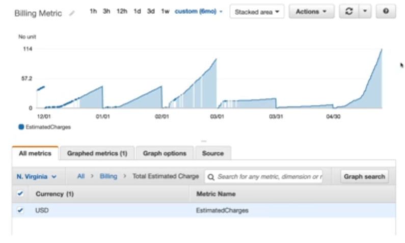
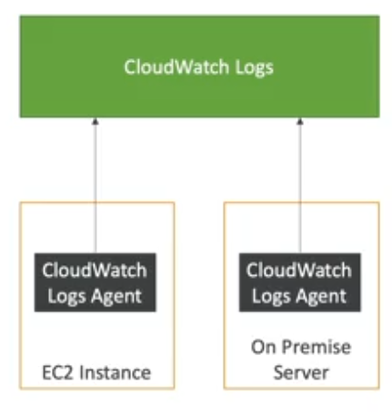
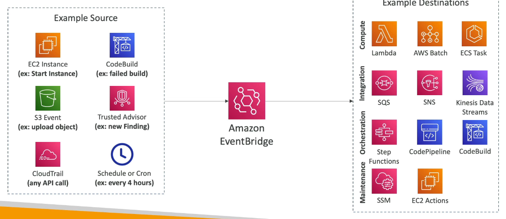

Cloud Monitoring
================

Let's get a better picture of the performance of our cloud deployments. The main tool to monitor our uses in AWS is cloud watch. This tool offer us features for metrics and alarms.

Cloud watch provides metrics for every service in AWS. A metrics is a variable to monitor, they are going through the time so, they will have timestamps and you can visualize all your metrics at once in a dashboard similar to the next image:

According the services there are some important metrics to monitor. For example for EC2 instances you can have metrics over CPU utilization, status checks, network consume, etc. There are default metrics every 5 minutes and you have an option to detailed monitoring but it is expensive. For EBS volumes you can check the disk read/writes. In S3 buckets is available the bucket size bytes, number of objects and all the request. Maybe the most important is billing, so you can define a total estimated charge (only on us-east-1). You can define service limits and also push your own metrics.

Complementary, we have the alarms that are used to trigger notifications for any metric. Below we list some action over specific services:

- Auto scaling, increase or decrease EC2 instance desired account.
- EC2 action, stop terminate reboot or recover an EC2 instance.
- SNS, send a notification into a SNS topic.

There are several options like sampling, percentages, ranges and more. You can chose the period on which to evaluate an alarm e.g., create a **billing alarm** on the cloud watch billing metric. The alarms have 3 states: Ok, insufficient data and alarm.

Cloud Watch Logs
----------------

When you have an application running on any server, usually you want the application to write some text about how it is doing e.g., execute clean ups when the data is not necessary. All these log are collected an when you needs to troubleshoot something you go through the log file to see what the application did.

In cloud watch logs you can collect log from:

- Elastic Beanstalk: collection of logs from application.
- ECS: collection from containers.
- AWS Lambda: collection from function logs.
- Cloud Trail: based on filter,
- Cloud Watch log agents: on ec2 machines or on-premises servers.
- Route53: log DNS queries.

The key feature is that it enable real time monitoring of log and you can adjust the log retention.

Let's review in detail the cloud watch logs for EC2. By default, no logs from EC2 instances will go to cloud watch. You need to run a cloud watch agent on EC2 to push the log files you want. Make sure that IAM permissions are correct, and these log agent can be set up on-premises too. The next image summarizes this description.

Event Bridge
------------

Event Bridge it used to be called cloud watch event is a service to set up rule for react to event happening within AWS:

- Schedule: schedule scripts to run cron jobs (e.g., every hour trigger a script on lambda function)
- Event pattern: set rules to react to a service to doing something (e.g., if someone log as root user, set a message in a SNS topic with email notification)

The next image summarize all the possible scenarios we can handle with event bridge:

By default event bridge works with a default event bus for events that happening inside AWS. But, it is possible to receive events from partners like zendesk or datadog an use the partner event bus and react to events happening outside AWS as well. Also, you could plug in your own custom application that would send their own events to you own custom bus to write any kind of integration you want and extends the event bridge capabilities.

There is a schema registry to model the event and see what it look like via data types. You can also archive all the vents sent to an event bus indefinitely or for a set period, then you can replay these archived events.
