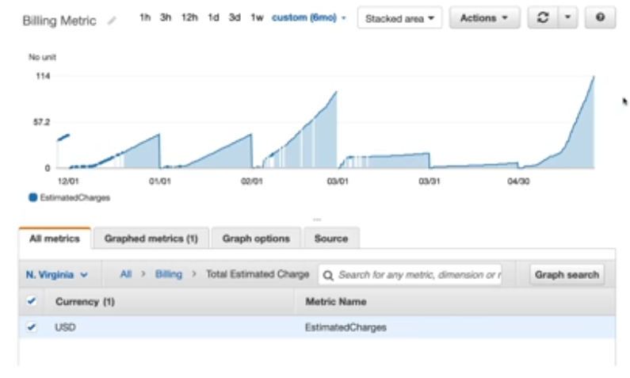

Cloud Monitoring
================

Let's get a better picture of the performance of our cloud deployments. The main tool to monitor our uses in AWS is cloud watch. This tool offer us features for metrics and alarms.

Cloud watch provides metrics for every service in AWS. A metrics is a variable to monitor, they are going through the time so, they will have timestamps and you can visualize all your metrics at once in a dashboard similar to the next image:

According the services there are some important metrics to monitor. For example for EC2 instances you can have metrics over CPU utilization, status checks, network consume, etc. There are default metrics every 5 minutes and you have an option to detailed monitoring but it is expensive. For EBS volumes you can check the disk read/writes. In S3 buckets is available the bucket size bytes, number of objects and all the request. Maybe the most important is billing, so you can define a total estimated charge (only on us-east-1). You can define service limits and also push your own metrics.

Complementary, we have the alarms that are used to trigger notifications for any metric. Below we list some action over specific services:

- Auto scaling, increase or decrease EC2 instance desired account.
- EC2 action, stop terminate reboot or recover an EC2 instance.
- SNS, send a notification into a SNS topic.

There are several options like sampling, percentages, ranges and more. You can chose the period on which to evaluate an alarm e.g., create a **billing alarm** on the cloud watch billing metric. The alarms have 3 states: Ok, insufficient data and alarm.
