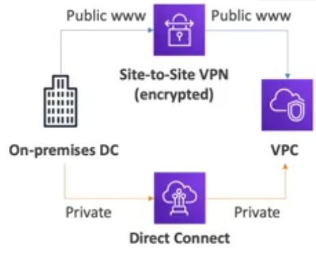

Networking
==========

Virtual Private Networks (in short VPC) is something you should know in depth for the AWS certified solution architect associate and AWS certified sysops administrator. At AWS certified cloud practitioner level you should know about:

- VPC, subnets, internet gateways and NAT gateways.
- Security groups, network ACL, VPC flow logs.
- VPC peering, VPC endpoints.
- Site to site VPN and direct connect.
- Transit gateway.

It is important look at the _default VPC_ created by AWS.

IP Addresses in AWS
-------------------

The internet protocol (in short IP) has two versions: 4 and 6. The version 4 enables 4.3 billion addresses and it can be public and private. Public means that can be used on the internet. By default, an EC2 instance gets a new public IP address every time you stop then start it. Private is used on private network (Local Area Network) such as AWS networking (e.g., 192.168.1.1).

There is Elastic IP that allows you to attach a fixed public IPv4 address to EC2 instance. However, all public IPv4 on AWS will be charged **$0.005** per hour including elastic IP. The free tier is about 750 hours usage per month.

The version 6 enables 3.4 x 10^38 addresses. Every IP address is public in AWS, this means that the is no a private range. It is free in AWS (e.g., 2001:db8:3333:4444:cccc:dddd:eeee:ffff).

VPC, Subnet, Internet Gateway and NAT Gateways
----------------------------------------------

A **virtual private cloud (in short VPC)** is a private network to deploy your resources and is an regional resources. **Subnets** allow you to partition you inside you VPC and is an availability zone resource. A **public subnet** is a subnet that is accessible from the internet. Here you set up your EC2 instances. For the other hand, the **private subnet**  is not accessible from the internet. Here you can set up your databases. To define access to the internet and between subnets, you use route tables.

The **internet gateways** helps our VPC instances to connect to internet. Public subnets have a rout to the internet gateway, The **network address translation (in short NAT) gateways** are managed by AWS but the **NAT instances** are self-managed and they allow your instances in your private subnets to access the internet while remaining private.

The next image recap the description of these concepts.

The default VPC provided by AWS have not private subnet and then neither NAT gateways. A good resource to check the range of IPs available fo a sub net is [CIDR](https://cidr.xyz).

Network Access Control List & Security Groups
---------------------------------------------

Network Access Control List (NACL in short) and security groups are lines of defense in our virtual private cloud. The next image shows how to NACL are the first line of defense and the security groups are the second one.

The next table recap the difference between each one:

| Network ACL                                                                                                                                             | Security Group                                                                                                                                               |
|---------------------------------------------------------------------------------------------------------------------------------------------------------|--------------------------------------------------------------------------------------------------------------------------------------------------------------|
| Operates at subnet level                                                                                                                                | Operates at instance level                                                                                                                                   |
| Supports allow and deny rules                                                                                                                           | Just support allow rules                                                                                                                                     |
| Is stateless: return traffic must be explicitly allowed by rules                                                                                        | Is statefull: return traffic is automatically allowed, regardless of any rules                                                                               |
| We process rules in number order when deciding whether to a allow traffic                                                                               | We evaluate all rules before deciding whether to allow traffic                                                                                               |
| Automatically applies to all instances in the subnets it is associated with (therefore, you do not have to rely on users to specify the security group) | Applies to an instance only if someone specifies the security group when launching the instance, or associates the security group with the instance later on |

VPC flow logs and VPC peering
------------------------------

VPC flow logs works to capture information about IP traffic going into interfaces (i.e., VPC flow logs, subnet flow logs and elastic network interface flow logs). It helps to monitor and troubleshoot connectivity issus like connections between subnets to internet, subnets to subnets or internet to subnets. Also it captures network information from AWS managed interfaces as elastic load balancers, elastic cache, RDS, etc. All these data can go to S3, cloud watch logs and kinesis data firebase.

The VPC peering connects two VPC, privately using the AWS network. Make them behave as if they were in the same network and the condition is not overlap CIDR (IP address range).

VPC peering connection is not transitive, so must be established for each VPC that need to communicate as shows the next image.

VPC Endpoints
-------------

All the AWS services we have seen so far are public. That means that when we connect to them, we are connecting to them publicy. There is a possibility to connect to these services using private AWS network instead publick internet network via VPC endpoints. This fives you enhanced security and lower latency to access AWS services.

You have to types of endpoints:

- VPC endpoint gateway, to connect to S3 and DynamoDB.
- VPC endpoint interface, to connect to the rest of services (e.g., cloud watch).

The next image sumarizes this distribution in a VPC:

AWS Private Link
----------------

Private Link is part of the VPC endpoint services and it works to establich a connectivity between a service running within your VPC to third party VPCs directly and privately. It does not require VPC peering, internet gateway, NAT or route tables becaus it is from the AWS private network. However you need a network load balancer in the service VPC and a elastic network interface in the costumer VPC. There you have a secure and scalable way to expose a service to several VPCs. The next image recap this description:

Direct Connect and Site to Site VPN
------------------------------------

In the world of hybrid cloud you will have an on-premise data center that you want to connect it to your VPC. To achieve this you have to options as shown the next image: site to site VPN or direct connect:

A site to site VPN connects on premises VPN to AWS. This connection is automatically encrypted andit goes over the **public internet**. In detail, the on premise part must use a customer gateway and the AWS part must use a virtual private gateway as shown the next image:

A direct connect establish a physical connection between on premises and AWS. This connection is private so it goes over a private network. The connection is secure and fast but take at least a month to establish.
