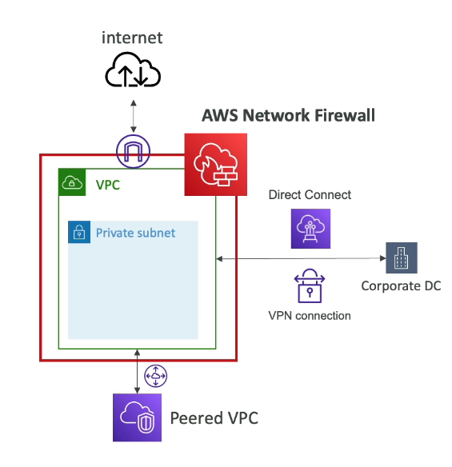

Security and Compliance
=======================

To start with security and compliance let's review again the shared responsibility model that can be summarized in the next diagram:

There are some shared controls like patch and configuration management, awareness and training that are no  in  the diagram.

So for RDS is responsibility of **AWS** manage the underlying EC2 instance, disable the SSH access automate the database and system operation patching and audit  the underlying instance with their disk and functionalities. In the other hand, the **customer** responsibilities are check the ports/IP/security group inbound rules in database, the in database user creation an permissions, config private and public access to the database, ensure parameter groups or SSL connection, and database encryption setting.

DDoS Attack
-----------

A distributed denial-of service (DDoS) attack on an infrastructure start with an hacker attack against our application server launching multiple master servers that via bots send request to our application server. The purpose is overwhelm the application server to making it not accessible for normal users. The next image recap these this description

AWS offers tools to protect against DDoS:

- **AWS shield standard** protects against DDoS attacks (e.g., floods, reflection, and 3/4 layer (TCP) attacks) for your website and applications for all customers and no additional costs.
- **AWS shield advanced** is a premium service for DDoS protection against sophisticated attacks on EC2, ELB, Cloud Front or Route 53.
- **AWS web access firewall** filter specific request based on rules recorded in a web access list for avoid common web exploit on layer 7 (i.e., HTTP) like SQL injection and cross-site scripting.
- **CloudFront** work combined to shield to get an attack mitigation at the edge.
- **Route 53** enable protection using the global edge network.
- **AWS auto scaling** leverage the situation to be ready to scale.

The next diagram is a reference to locate this tools in a architecture for DDoS protection.

AWS Network Firewall
--------------------

All these attack from layer 3 to 7 can be executed in a virtual private cloud. To protect a VPC you should use AWS network firewall because there you can inspect any direction and control VPC to VPC traffic, outbound/inbound to/from internet and direct connect and site-to-site VPN. The next image recap this description.

