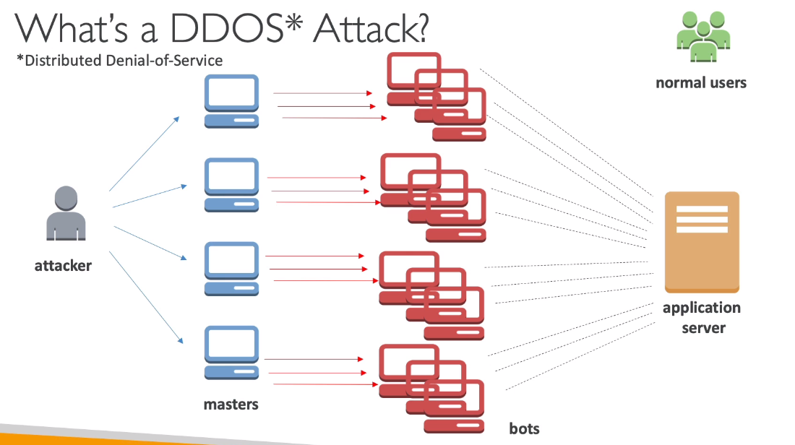

Security and Compliance
=======================

To start with security and compliance let's review again the shared responsibility model that can be summarized in the next diagram:

There are some shared controls like patch and configuration management, awareness and training that are no  in  the diagram.

So for RDS is responsibility of **AWS** manage the underlying EC2 instance, disable the SSH access automate the database and system operation patching and audit  the underlying instance with their disk and functionalities. In the other hand, the **customer** responsibilities are check the ports/IP/security group inbound rules in database, the in database user creation an permissions, config private and public access to the database, ensure parameter groups or SSL connection, and database encryption setting.

DDoS Attack
-----------

A distributed denial-of service (DDoS) attack on an infrastructure start with an hacker attack against our application server launching multiple master servers that via bots send request to our application server. The purpose is overwhelm the application server to making it not accessible for normal users. The next image recap these this description

AWS offers tools to protect against DDoS:

- **AWS shield standard** protects against DDoS attacks (e.g., floods, reflection, and 3/4 layer (TCP) attacks) for your website and applications for all customers and no additional costs.
- **AWS shield advanced** is a premium service for DDoS protection against sophisticated attacks on EC2, ELB, Cloud Front or Route 53.
- **AWS web access firewall** filter specific request based on rules recorded in a web access list for avoid common web exploit on layer 7 (i.e., HTTP) like SQL injection and cross-site scripting.
- **CloudFront** work combined to shield to get an attack mitigation at the edge.
- **Route 53** enable protection using the global edge network.
- **AWS auto scaling** leverage the situation to be ready to scale.

The next diagram is a reference to locate this tools in a architecture for DDoS protection.

AWS Network Firewall
--------------------

All these attack from layer 3 to 7 can be executed in a virtual private cloud. To protect a VPC you should use AWS network firewall because there you can inspect any direction and control VPC to VPC traffic, outbound/inbound to/from internet and direct connect and site-to-site VPN. The next image recap this description.

AWS Firewall Manager
--------------------

The firewall manager is used to manage security rules in all accounts of an AWS organization. The security policy is a common set security rules and a general use is on VPC security groups for EC2, application load balancer and more. Also, you can set WAF rules, AWS shield advanced and AWS network firewall. The rules are applied to new resources as they are created across all and future account in your organization.

Penetration Testing
-------------------

Penetration testing is when you are trying to attack your own infrastructure to test your security.

An AWS customer are welcome to carry out security assessments against their AWS infrastructure without prior approval for 8 services:

1. EC2 instances, Nat Gateways, and  ELB
2. Amazon RDS.
3. Amazon CloudFront.
4. Amazon Aurora.
5. Amazon API Gateways.
6. AWS Lambda.
7. Amazon Lightsail resources.
8. Amazon Elastic Beanstalk environments.

Keep in mind that this list can increase over time.

There are prohibited activities on AWS cloud. For example, execute DNS zone walking via Route 53 hosted zones. ,denial of services and port/protocol/request flooding.

For any other simulated event you should contact via email the aws security team.

Encryption with KMS and CloudHSM
--------------------------------

Before to talk about encryption, let's review the next 2 concepts, data at rest and data in transit.

Data at rest is data stored or archived on a device (e.g., hard disk, on a RDS instance, in S3 glacier deep archive, etc). Data in transit is data being moved from one location to another (e.g., transfer from on-premises to AWS, EC2 to DynamoDB, etc). This mean that data is transferred on the network. The idea is encrypt data in both states to protect it ash shown the next image:

For encryption we leverage encryption keys.

AWS Certificate Manager
-----------------------

AWS certificate manager (in short ACM) let you easily provision, manage and deploy secure sockets layer and transport layer security (SSL/TSL in short) certificates. It is used to provide in-flight encryption for websites (i.e., HTTPS). It supports public and private TLS certificates and is free of chare for public ones. The renewal is automatic and it has integrations with ELS, cloud front distributions and APIs on API gateway. The next image is the application of a TLS certificate on an application load balancer.

AWS Secrets Manager
-------------------

In Secrets Manager, a _secret_ consists of secret information, the _secret value_, plus metadata about the secret. A secret value can be a string or binary.

To store multiple string values in one secret, we recommend that you use a JSON text string with key-value pairs

AWS Secrets Manager helps you manage, retrieve, and rotate database credentials, application credentials, OAuth tokens, API keys, and other secrets throughout their lifecycles. Many AWS services store and use secrets in Secrets Manager.

Secrets Manager helps you improve your security posture, because you no longer need hard-coded credentials in application source code. Storing the credentials in Secrets Manager helps avoid possible compromise by anyone who can inspect your application or the components. You replace hard-coded credentials with a runtime call to the Secrets Manager service to retrieve credentials dynamically when you need them. The secrets are encrypted using KMS.

AWS Artifact
------------

AWS Artifact is a portal that provides customers with on-demand access to AWS compliance documentation and AWS agreement. So is not a service by itself. You can get access to:

- Artifact reports: allows you to download AWS security and compliance documents from third-party auditors, like AWS ISO certification, payment card industry (PCI) or system and organization control (SOC).
- Artifact agreements: allows you to review, accept, and track the status of AWS agreements such as the business associate addendum (BAA) or the health insurance portability and accountability (HIPAA) for an individual account in you organization.

It is used to support internal audit or compliance.

Guard Duty
----------

Guard Duty is an intelligent threat discovery to protect your AWS account using machine learning algorithm, anomaly detection and third party data. It has a 30 days trial and you don't need to install software. The input data includes:

- Cloud Trail Management Events: unusual API calls, unauthorized deployments.
- VPC Flow Logs: unusual internal traffic, unusual IP address.
- DNS Logs: Compromised EC2 instances sending encoded data within DNS queries.
- Optional feature: EKS audit logs, lambda, s3 data events and more.

The next image summarizes the use of guard duty in AWS:

Amazon Inspector
----------------

Amazon inspector is a service for automated security assessments over EC2, container images pushed to ECR and lambda functions. It makes continuous scanning of the infrastructure only when needed and focus on package vulnerabilities and network reachability.

With EC2 instances it leverage the AWS system manager agent, analyze against unintended network accessibility and analyze the running OS against known vulnerabilities.

On ECR it perform assessment of container images as the are pushed.

For lambda function identifies software vulnerabilities in function and package dependencies. Also it assess the function that are deployed.

The inspector is integrated with AWS security hub, can generate reports and send the findings to amazon event bridge. A risk score is associated with all vulnerabilities for prioritization. The next diagram summarizes the inspector context.

AWS Config
----------

This service helps you to auditing and recording compliance of your AWS resources and record configurations and change over time. You can store the configuration data in S3 and answer the next questions:

- Is there unrestricted SSH access to my security groups?
- Do my buckets have any public access?
- How has my ALB configuration change over time?

Then you can receive alerts via SNS notification for any changes. AWS config is a per region service and can be aggregated across regions an accounts.

The next are the 3 key views of the config resource: View compliance of a resource over time:

View of configuration of a resource over time.

View CloudTrail API call if enabled.

Amazon Macie
------------

Amazon Macie is a fully manage data security and data privacy service that use machine learning and pattern matching to discover and protect your sensitive data in AWS. It helps identify and alert you to sensitive data, such as personally identifiable information (in short PII)

