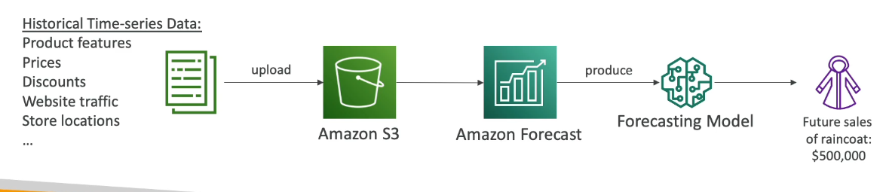

Machine Learning
================

Machine Learning is a discipline within the field of Artificial Intelligence which, by means of algorithms, provides computers with the ability to identify patterns from mass data in order and to make predictions (predictive analytics). This learning method allows computers to perform specific tasks autonomously, that is, without the need to be programmed.

The term was first used in 1959. It has, however, gained relevance in recent years due to the increase in computing capacities and the huge increase in data. Automatic learning techniques are, in fact, a fundamental part of Big Data.

Amazon Rekognition
------------------

Automate and lower the cost of your image recognition and video analysis with machine learning. It helps you to find objects, people text, scenes in images and videos using machine learning. Facial analysis and facial search to do user verification or people counting, creating a database of familiar faces or compare against celebrities. The use cases are: labeling, content moderation, text detection, face detection and analysis, face search and verification, celebrity recognition adn pathing.

Amazon Transcribe
-----------------

Amazon Transcribe is a service to automatically convert speech to text. It uses a deep learning process called automatic speech recognition (ASR) to convert speech to a text quickly and accurately. Automatically remove personally identifiable information using redaction. It supports automatic language identification fo multi-lingual audio. The uses cases are: transcribe customer services call. automate closed captioning and subtitling, and generate metadata for media assets to create a fully searchable archive.

Amazon Polly
------------

Polly is the opposite of Transcribe, it turns text to speech using deep learning. It allows you to create application that talk.

Amazon Translate
----------------

This service is used to a natural and accurate language translation. It allows you to localize content such as websites and applications for international users and to easily translate large volumes of text efficiently.

Amazon Lex
----------

Amazon Lex is same the technology that powers Alexa. It is a automatic speech recognition (ASR) to convert speech to text. It has natural language understanding to recognize the intent of text, callers and is used to build chat bots.

It works with Amazon Connect, a tool to receive call, create contact flows, cloud based virtual contact center. It can integrate with CRM systems or AWS. No upfront payments, 80% cheaper than traditional contact center solutions.

The next diagram summarize a phone call schedule appoint process using Lex and Connect.

Amazon Comprehend
-----------------

Amazon Comprehend is for natural language processing. It is fully managed and serverless service. It uses machine learning to find insights an relationships in text (e.g., language of text, analyze text using tokenization and parts of speech, extracts key phrases, places, people, brands, or events, and more.)

The sample use cases are: analyze customer interactions (emails) to find what leads to a positive or negative experience, and create and groups articles by topics that comprehend will uncover.

Amazon SageMaker
----------------

SageMaker is a fully managed service for developers and data scientist to build machine learning models. Typically it is difficult to do all the precesses in one place with provision servers. Here machine learning process is simplified. The next is an example to predict your exam score:

Amazon Forecast
---------------

It is a fully managed service that uses machine learning to deliver highly accurate forecasts (e.g., predict the future sales of a raincoat). It is 50% more accurate that looking at the data itself and reduce forecasting time from months to hours.

Amazon Kendra
-------------

It is a fully managed document search service powered by machine learning. Extract answers from within a  document with natural language capabilities. Learn from  user interactions to promote  preferred results (i.e., incremental learning). It has the ability to manually fine-tune search results. The next diagram is an example to identify where is the IT support desk:

