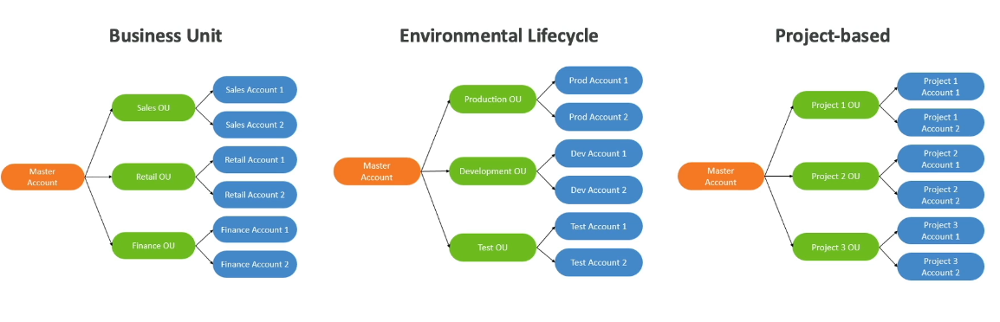

Account Management, Billing & Support
=====================================

AWS Organizations
-----------------

This is a global service that allows to manage multiple AWS accounts via a master account. Their purpose is get cost benefits likes consolidate billing across all accounts via a single payment method, pricing benefits from aggregates usage or pooling of reserver EC2 instances for optimal savings.

There is an API available to automate AWS account creation and you can restrict the account privileges using Service Control Policies (SCP in short).

For big uses of AWS, you should think about the multi-account strategies. You can create accounts per department, per cost center, per dev/test/prod environment, based on regulatory restrictions using SCP, for better resource isolation (e.g., VPC), to have separate per-account service limits, isolated account for logging.

The range of options is extensive so you should decide between a multi account versus one account with multi VPC. Use tagging standards for billing purposes. Enable CloudTrail on all accounts, send logs to central S3 account send CloudWatch logs to central logging account.

Below, a image with 3 option to set the organization unit:

A possible distribution on these boxes is represented in the next diagram.

With service control policies you can whitelist or blacklist IAM actions applied at the organization unit or account level but not to the master account. The SCP is applied to all the users and roles of the account, including root and does not affect service linked roles (service linked roles enable other aWS service to integrate with aWS organizations). It must have an explicit allow that by default does not allow anything and some use cases are:

- Restrict access to certain service (e.g., cannot use EMR).
- Enforce PCI compliance by explicitly disabling services.
