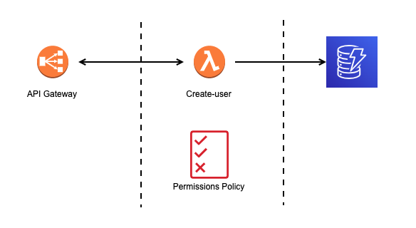
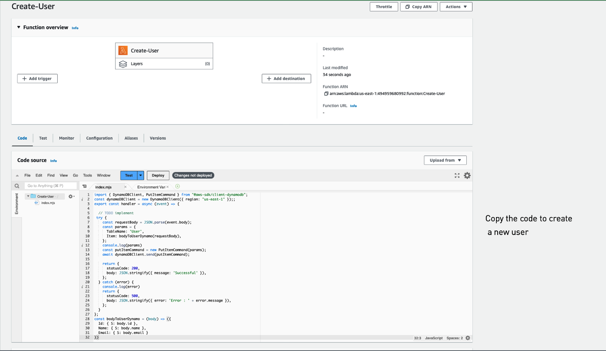
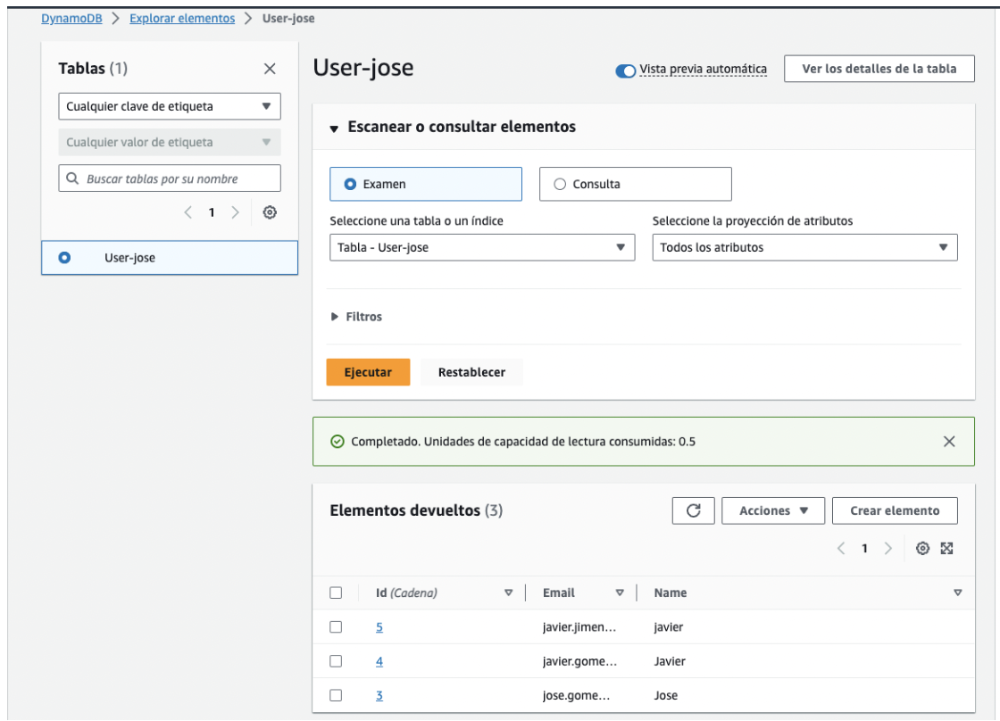

Creating a lambda in AWS console
================================

The goal of this doc is to create a simple lambda function from the AWS console that will receive an event from API Gateway and store the received data in DynamoDB, creating a RESTful service. The next image summarizes this description.



Creating a dynamo table
-----------------------

> **Note**: keep in mind that the selected region in AWS is **us-west-2** to guarantee the expected behavior used in this guide. So let's start with the dynamo setup.

Amazon DynamoDB is a managed NoSQL database service that deliver fast and consistent performance along with seamless scalability. With dynamo, you can skip administrative tasks associates with using or expanding distributed databases. There is no need to worry about provisioning, installing or configuring hardware, data replication, software patching or cluster scalability. In addition, dynamo provides encryption-at-rest to simplifies the protection of sensitive data.

Let's setup the dynamo database following the next steps:

1. Click on the search bar.
2. Type Dynamo.
3. Click on the **DynamoDB** service.
4. In the Dashboard view, look for the **Create table** button.
5. Click on **Create table** button.
6. Fill the **Create table** form with the next info:
    - Table name: User_slbenitezd
    - Partition key: id
7. Use the default table settings
8. Click on **Create table** button.

Your `User_slbenitezd` table is already created, waiting to store the info tha the `createUser` lambda will deliver.

Creating a lambda
-----------------

The next step will be provisioning a lambda called `createUser` and store the information in a dynamo database, like show the next image:


So, let's continue with the lambda setup, following these instructions:

1. Click on the search bar.
2. Type Lambda.
3. Click on the **Lambda** service.
4. Look for the **Create function** button.
5. Click on **Create function** button.
6. Fill the **Create function** form with the next info:
    - Author from scratch
    - Function name: createUser
    - Runtime: Node.js 18.x
    - Architecture: x86_64
    - Execution role: Create a new role with basic Lambda permissions
7. Click on **Create function** button.

Now your lambda is already create and you will have the next screen:



To continue, please copy the next code and paste it in the `index.mjs` file in the AWS console.

> Note: in the line 9 please update the `<your_id>`  placeholder with your id

```js
import { DynamoDBClient, PutItemCommand } from "@aws-sdk/client-dynamodb";

const dynamoDBClient = new DynamoDBClient({ region: "us-west-2" });;

export const handler = async (event) => {
 try {
    const requestBody = JSON.parse(event.body);
    const params = {
      TableName: 'User-slbenitezd>',
      Item: bodyToUserDynamo(requestBody),
    };
    console.log(params)
    const putItemCommand = new PutItemCommand(params);
    await dynamoDBClient.send(putItemCommand);

    return {
      statusCode: 200,
      body: JSON.stringify({ message: 'Successful' }),
    };
  } catch (error) {
    console.log(error)

    return {
      statusCode: 500,
      body: JSON.stringify({ error: 'Error : ' + error.message }),
    };
  }
};

const bodyToUserDynamo = (body) => ({
  Id: { S: body.id },
  Name: { S: body.name },
  Email: { S: body.email }
})
```

In short, this code define a handler that will store the information in a payload into the table name that we define in dynamo.

Configure permissions b/w dynamo and lambda
-------------------------------------------

Before to test the lambda we must setup the permissions between the lambda and dynamo. Please follow the next steps:

1. Click on the search bar.
2. Type Lambda.
3. Click on the **Lambda** service.
4. Look for the **createUser** lambda (lambda create before).
5. Navigate to the **Configuration** tab.
6. In the side bar, click on **Permission** option.
7. At the top of the view, click on the **role name** link.
8. We will be redirected to the **Roles** of IAM.
9. Check the **Permissions policies** section.
10. Click on the **Add permissions** dropdown.
11. Select the **Attach policies** option.
12. In the search bar, type "Dynamo"
13. Check the **AmazonDynamoFullAccess** policy.
14. Click on the **Add permission** button

Now our lambda have full access to the dynamo database and it is time to test our lambda for first time.

Testing the lambda
-------------------------------------------

To test the lambda, please check the following instructions:

1. Click on the search bar.
2. Type Lambda.
3. Click on the **Lambda** service.
4. Look for the **createUser** lambda (lambda create before).
5. Navigate to the **Test** tab.
6. In the **Test event** section, check the **Create event** option.
7. Put a name to the event (e.g., Test).
8. In the Event JSON editor add the content that we share in the end of this list.
9. Click on **Save** button.
10. Press the **Test** button.

If everything works as expected, you should get the next message: "Executing function: no errors". Below is the JSON required for step 8:

```json
{
  "body": "{ \"id\": \"3\", \"name\": \"Jose\", \"email\": \"jose.gome@adidas.com\" }"
}
```

When you check the dynamo table you should see a new row with the event information.

Integrating lambda with API Gateway
-----------------------------------

Let's integrate the created lambda with a API Gateway event. Please follow the next steps:

1. Click on the search bar.
2. Type API.
3. Click on the **API Gateway** service.
4. Click on the **Create API**.
5. In the **Create an API** forum fill with the next contents:
  - In the Integrations section chose "Lambda"
  - In the lambda function select the "createUser"
  - Enter an API name (e.g., api-crud-user)
6. Click on the **Next** button.
7. In the **Configure routes** section fill with the next contents:
  - Method: POST
  - Path: user
8. Click on the **Next** button.
9. In the **Review and Create** section validate the setup.
10. Click on **Create** button.

Our API Gateway is already created.

Testing endpoint
----------------

Now is time to test our endpoint. Please chekc the next instructions:

1. Click on the search bar.
2. Type Lambda.
3. Click on the **Lambda** service.
4. Look for the **createUser** lambda (lambda create before).
5. Navigate to the **Configuration** tab.
6. Look for the **Triggers** section on the sidebar.
7. Click on **Triggers**.
8. Check here the API endpoint value.
9. Copy this url.

Now we need a REST API client. For practical purpose, in this guide we will use cURL. Please run the next command in your terminal:

```
curl -H "Content-Type: application/json" \
  -X POST -d '{ "id": "6", "name": "javier", "email": "javier.jimenez@adidas.com" }' https://<your_url>.execute-api.us-west-2.amazonaws.com/user
```

> Note: replace `<your_url>` for the url copied in the step 9 of the previous list.

If everything works as expected, you should see the rows in the dynamo table as show the next image:


