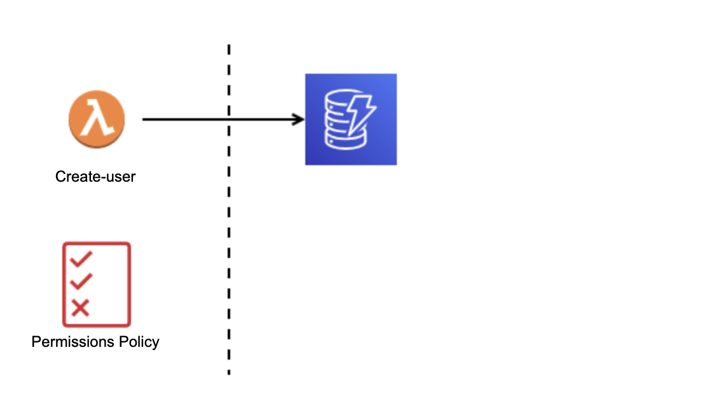

Creating a lambda in AWS console
================================

The goal of this doc is to create a simple lambda function from the AWS console that will receive an event from API Gateway and store the received data in DynamoDB, creating a RESTful service. The next image summarizes this description.


Creating a lambda
-----------------

The first step will be provisioning a lambda called `createUser` and store the information in a dynamo database, like show the next image:



Please, keep in mind that the selected region in AWS is **us-west-2** to guarantee the expected behavior used in this guide. So let's start with the dynamo setup.

Amazon DynamoDB is a managed NoSQL database service that deliver fast and consistent performance along with seamless scalability. With dynamo, you can skip administrative tasks associates with using or expanding distributed databases. There is no need to worry about provisioning, installing or configuring hardware, data replication, software patching or cluster scalability. In addition, dynamo provides encryption-at-rest to simplifies the protection of sensitive data.

Let's setup the dynamo database following the next steps:

1. Click on the search bar.
2. Type Dynamo.
3. Click on the **DynamoDB** service.
4. In the Dashboard view, look for the **Create table** button.
5. Click on **Create table** button.
6. Fill the **Create table** form with the next info:
    - Table name: User_slbenitezd
    - Partition key: id
7. Use the default table settings
8. Click on **Create table** button.

Your `User_slbenitezd` table is already created, waiting to store the info tha the `createUser` lambda will deliver. So, let's continue with the lambda setup, following these instructions:

1. Click on the search bar.
2. Type Lambda.
3. Click on the **Lambda** service.
4. Look for the **Create function** button.
5. Click on **Create function** button.
6. Fill the **Create function** form with the next info:
    - Author from scratch
    - Function name: createUser
    - Runtime: Node.js 18.x
    - Architecture: x86_64
    - Execution role: Create a new role with basic Lambda permissions
7. Click on **Create function** button.

Now your lambda is already create and you will have the next screen:


To continue, please copy the next code and paste it in the `index.mjs` file in the AWS console.

> Note: in the line 9 please update the `<your_id>`  placeholder with your id

```js
import { DynamoDBClient, PutItemCommand } from "@aws-sdk/client-dynamodb";

const dynamoDBClient = new DynamoDBClient({ region: "us-west-2" });;

export const handler = async (event) => {
 try {
    const requestBody = JSON.parse(event.body);
    const params = {
      TableName: 'User-<your_id>',
      Item: bodyToUserDynamo(requestBody),
    };
    console.log(params)
    const putItemCommand = new PutItemCommand(params);
    await dynamoDBClient.send(putItemCommand);

    return {
      statusCode: 200,
      body: JSON.stringify({ message: 'Successful' }),
    };
  } catch (error) {
    console.log(error)

    return {
      statusCode: 500,
      body: JSON.stringify({ error: 'Error : ' + error.message }),
    };
  }
};

const bodyToUserDynamo = (body) => ({
  Id: { S: body.id },
  Name: { S: body.name },
  Email: { S: body.email }
})
```